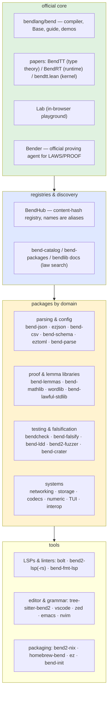

# Bend ecosystem map (initial)

> **New here?** Start with [README.md](README.md) — the guided tour (goals, data structures, the high-level laws). This file is a deep dive.

*Recon 2026-10-02, source: [777genius/awesome-bend](https://github.com/777genius/awesome-bend) (list last checked 2026-10-01) plus READMEs of the highlighted repos. **README-level only — nothing cloned or executed.** Target: current Bend 2.0.x (we run 2.0.34). This is an initial map: domains are roughly right, coverage within a domain is not exhaustive, and nothing here is an endorsement until we have read the code.*

## Official core

- **[bendlang/bend](https://github.com/bendlang/bend)** — compiler, `Base`, `bend guide`, demos, papers. Install: `curl -fsSL https://bend-lang.com/install.sh | sh`.
- **[Bender](https://bend-lang.com/bender)** — official *proving agent* for `LAWS.bend` / `PROOF.bend`. *(Relevant: could review/fill our claims.)*
- **[Lab](https://bend-lang.com/#lab)** — in-browser playground.
- **[Hub](https://hub.bend-lang.com)** — content-hash registry (`import 0x…/file.bend`); names/versions (`import name@version/…`) are aliases. Names 12–64 chars claimable, shorter auctioned. Search / hot / posts.

## Registries & discovery

- [bend-catalog](https://kbrianps.github.io/bend-catalog/) — live hub index: every hash, laws, size, import line.
- [Bend Packages](https://777genius.github.io/bend-packages/) — community catalog with search/filters (not official).
- [Bend Docs (bendlib)](https://bendlib.github.io/bendlib/) — generated API docs, checker status, **law search**. *(Find a lemma before proving one.)*

## Packages by domain

### Parsing & config *(our hottest area)*

- **[bend-json](https://github.com/rootagi/bend-json)** (`import 0xf776c27e…/json.bend`) — full JSON AST (escapes, `\uXXXX`, big ints), RFC 6901 pointer, typed extractors, NDJSON, 60 laws + Python differential tests. **Uses explicit state machines instead of deep recursion** — same no-mutual-recursion workaround we derived; proves general JSON is feasible in Bend.
- [ezjson](https://github.com/Emerging-Patterns/ezjson) (`emerging-ezjson@1.1.0.0`) — second full JSON impl, to compare against bend-json.
- [bend-csv](https://github.com/nohzafk/bend-csv) (`bend-csv-parser@0.1.0.1`) — CSV with 12 machine-checked core laws, TS bridge; ~2× Deno `@std/csv`. Needs Bend 2.0.34.
- [bend-schema](https://github.com/nohzafk/bend-schema) — JSON schema checker with a proved core. *(Validator-story adjacent.)*
- [eztoml](https://github.com/Emerging-Patterns/eztoml) — TOML parser/renderer.
- [bend-parse](https://github.com/777genius/bend-parse) (`bend-scanner@0.1.0.0`) — cursor/digits/finish scanner primitives, one file. Explicitly *not* combinators.
- [toon_bend](https://github.com/Dicklesworthstone/toon_bend) — JSON ↔ TOON codec, golden-tested.

### Proof & lemma libraries *(backlog A3 brick prereqs)*

- **[bend-lemmas](https://github.com/caiodomingues/bend-lemmas)** — Nat/List/Bool lemmas "every PROOF.bend re-proves": `add_comm/assoc/swap`, `sub_self`, `add_sub`, `LE(a,b)` decider (our `le_ok` pattern). Could pre-pay `window_span`'s sub-bricks.
- [bend-mathlib](https://github.com/bendlib/bendlib) (`bend-mathlib@0.7.0.0`) — machine-checked arithmetic/list/sorting/string/algebra.
- [wordlib](https://github.com/Yazington/wordlib) — machine-word laws + list laws + sum prover. *(u32 job-file data plane.)*
- [bend-lawful-stdlib](https://hub.bend-lang.com/n/bend-lawful-stdlib) — Ord/Semigroup/Group typeclasses with laws.
- [bend-collections](https://github.com/Giulio2002/bend-collections) — verified containers (hash map, tree map, heap, deque, LRU) + SHA-256.
- [bend-sha256](https://github.com/Giulio2002/bend-sha256) — SHA-256 proved against FIPS 180-4.
- [bend-trace-context](https://github.com/LucasGois1/bend-trace-context) — W3C Trace Context with proved protocol rules. Needs 2.0.34.
- [ProofPack State](https://github.com/bkase/proofpack-state) — Git object reachability queries with a proved set-algebra core.
- [BendVerify](https://github.com/kingcharlezz/bendverify) — proof-carrying compiler optimisation (Lean-checked equivalence before benchmarking).

### Testing, falsification, QA *(backlog E19)*

- **[bendcheck](https://github.com/Yazington/bendcheck)** (`import 0x738b3053…/check.bend`) — property-based testing: generators, shrinking, and **`lawcheck`**: fuzz every law in a `LAWS.bend` with no test code. Built on 2.0.28.
- **[bend-falsify](https://github.com/nohzafk/bend-falsify)** — falsify laws on literal instances before proving (`def name() -> claim: {==}` at literals), plus **proof mutation testing** (`runMutants`: break one core line, the dependent law must fail). Needs `bun`.
- **[bend-ldd](https://github.com/nohzafk/bend-ldd)** — agent skill codifying law-driven development: state → falsify → prove → mutate. Gate wrapper: `--verdict` in ≤5 s.
- [bend2-fuzzer](https://github.com/nicolas-abril/bend2-fuzzer) — differential fuzzer, JS vs C backends. *(Codegen TCB.)*
- [Bend verdict investigation](https://github.com/leo-guinan/bend-verdict-investigation) — probes of checker vs BendTT kernel, **incl. a reported mismatch the kernel rejects**. Read before leaning harder on `--verdict`.
- [bend-crater](https://github.com/PedroVIOliv/bend-crater) / [bend-crater](https://github.com/costamatheus97/bend-crater) — Hub compatibility matrices across releases (errors, timings, CPU/JS lanes).
- [bend-init](https://github.com/gouveags/bend-init) — scaffolds a law-backed starter project.

### Networking

- [bend-net](https://github.com/naoeosavio/bend-net) — HTTP/1.1+2, HTTPS, DNS, TLS, WebSockets.
- [scrapanium](https://github.com/0x5f3759df-fs/scrapanium) — HTTP/1.1+2 + TLS WebSockets over native transport.
- [ezhttp](https://github.com/Emerging-Patterns/ezhttp) — HTTP/1.1 client/server (auth, cookies, CORS).
- [bURL](https://github.com/rosdyana/bURL) — HTTP(S) + DNS client with a proof-checked parser.
- [stiff](https://github.com/fraylabs/stiff) — experimental HTTP/routing/streaming + SQLite state.
- [bulkhead](https://github.com/eserilev/bulkhead) — Ethereum consensus remote signer with slashing-protection laws.

### Storage

- [mylsm](https://github.com/FabianVegaA/mylsm) — durable LSM KV store (`mylsm-lsm-store@0.3.2.0`).
- [ber](https://github.com/FabianVegaA/ber) — version-controlled data on MyLSM, certified merges.
- [bend-over](https://github.com/subtleGradient/bend-over) — SQLite + JS interop (native/Bun/browser).

### Codecs, media, text

- [bend-codec](https://github.com/777genius/bend-codec) — hex, Base64, UTF-8 (`bend-encoding@0.2.0.0`).
- [ezimg](https://github.com/Emerging-Patterns/ezimg) — PNG + baseline JPEG. [ezaudio](https://github.com/Emerging-Patterns/ezaudio) — PCM/WAV/MP3.
- [bend-tty](https://github.com/caiodomingues/bend-tty) / [bend-tui](https://github.com/caiodomingues/bend-tui) — raw-mode terminal + views with a proof-checked frame shape.

### Numeric & scientific *(TVB-adjacent)*

- [gauss](https://github.com/pjdotson/gauss) — unit-aware calculations with SI dimensions.
- [unsga3-bend](https://github.com/AppSprout-dev/unsga3-bend) — U-NSGA-III optimiser.
- [bend_tensors](https://hub.bend-lang.com/n/bend-tensors) — dense linear algebra with shapes in the types.
- [bend-parallel](https://github.com/costamatheus97/bend-parallel) — prefix sums, histograms, stable counting sort.
- [BendSR](https://github.com/k3ybladewielder/BendSR) — parallel symbolic regression.
- [bend-math](https://github.com/lilalittle/bend-math) — symbolic + forward-mode autodiff with an agreement proof.

### Language, interop, misc

- [bendygrad](https://github.com/KapioKai/bendygrad) — tinygrad front-end (views, buffers, autodiff, SGD). *Our PORTING_RULES.md reference.*
- [bend-machines](https://hub.bend-lang.com/0x9fc0cec754888f0fecabce899ddf2ee5/main.bend) — Lisp/Core/STG/STG→C in one package.
- [bend-frontend](https://github.com/ind-igo/bend-frontend) / [bend-evm](https://github.com/ind-igo/bend-evm) — typed `Core.Program` export; EVM/Yul backend.
- [bendler](https://github.com/lukaszsamson/bendler) — Bend from Elixir (port/NIF). [bend-over](https://github.com/subtleGradient/bend-over) — JS/SQLite interop. [bend-emit](https://github.com/nohzafk/bend-emit) — pure core → typed ES module.
- [bendc](https://github.com/Lulzx/bendc) — self-hosting Bend→C compiler. [teamy-bend](https://github.com/TeamDman/teamy-bend) — independent Rust subset impl.
- [snap](https://github.com/Emerging-Patterns/snap) — process runner (`run`/`start`/`par`).
- [V](https://github.com/PedroAVJ/n) — data structures/architecture as types. [jonlib](https://github.com/jonathanperis/jonlib) — graphics/raylib-direction.

## Tools

- LSPs/lint: [bolt](https://github.com/Emerging-Patterns/bolt) (linter+checker+LSP, `bolt@1.12.0.0`), [bend2-lsp](https://github.com/don2e4/bend2-lsp), [bend2-lsp-rs](https://github.com/IlyaGulya/bend2-lsp-rs), official [bend-fmt-lsp](https://github.com/bendlang/bend/tree/main/tools/bend-fmt-lsp) (format-only).
- Editor/grammar: [tree-sitter-bend2](https://github.com/nicolas-abril/tree-sitter-bend2) (+ [davidawad fork](https://github.com/davidawad/tree-sitter-bend2), [FabianVegaA](https://github.com/FabianVegaA/tree-sitter-bend)), VS Code ×4, [zed](https://github.com/chhoumann/zed-bend) ×3, [bend-mode.el](https://github.com/davidawad/bend-mode.el), [bend2-nvim](https://github.com/nuxyel/bend2-nvim) (incl. Proof Explorer), [bend-idea](https://github.com/dearlordylord/bend-idea), [bend-grammar](https://github.com/gouveags/bend-grammar) (TextMate + tokenizer regression tests).
- Packaging: [bend2-nix](https://github.com/nicolas-abril/bend2-nix) / [y0usaf](https://github.com/y0usaf/bend2-nix) / [bend.nix](https://github.com/lukasl-dev/bend.nix), [homebrew tap](https://github.com/kitevi/homebrew-bend), [ez](https://github.com/Emerging-Patterns/ez) project management. **Do not use nixpkgs `bend` — that is Bend 1.**

## Learning

- [Guide](https://github.com/bendlang/bend/blob/main/guide/GUIDE.md) (= `bend guide`), [bend2-from-zero](https://github.com/nohzafk/bend2-from-zero) (incl. probes that *should* fail), [Bend, Explained](https://raunak-11.github.io/bend-explainer/), [bend2.dev](https://bend2.dev/), [aprendendo-bend2](https://github.com/erickweil/aprendendo-bend2) (pt).

## Demos (selected)

Official: [Winning Is Impossible](https://github.com/bendlang/bend/tree/main/demos/app_win_is_bug_2d) (game + proof you cannot win), [Slash Boss 3D](https://github.com/bendlang/bend/tree/main/demos/app_slash_boss_3d), [rollback netcode](https://github.com/bendlang/bend/tree/main/demos/io_rollback_netcode). Community: [bendoom](https://github.com/eliesgalvira/bendoom) (WAD at runtime, laws), [BendJVM](https://github.com/MatheusBBarni/bendJVM) (differential vs `java`), [birc](https://github.com/angerman/birc) (verified IRC), [bend2-quantum-simulator](https://github.com/splch/bend2-quantum-simulator), raytracers/voxel demos (several), [Eldergrove Faire](https://github.com/RedLynx101/eldergrove-faire) (16 machine-checked laws). Also [Built with Bend](https://builtwithbend.com) directory.

## Benchmarks & papers

- [Official bench](https://github.com/bendlang/bend/tree/main/bench) (compiler, proof-checker, CPU, GPU), [bend-bench](https://github.com/wakamex/bend-bench) (independent, OpenMP/CUDA).
- Papers in the repo: **BendTT.pdf** (affine dependent type theory), **BendRT.pdf** (runtime), **bendtt.lean** (kernel + proofs, what `--verdict` runs).

## Community

[Discord](https://discord.bend-lang.com) · [X](https://x.com/bendlang) · [Reddit](https://www.reddit.com/r/bendlang/) · [GitHub issues](https://github.com/bendlang/bend/issues).

## Relevance to tvb-bend — take order

1. **bendcheck** → VETTED, RAN on 2.0.34 (python3 only): self-test 13/14 (one cosmetic version-string assert), mutation 6/6 killed; `lawcheck` fuzzed 49 of 147 laws in LAWS_router.bend at 2 seeds (1x200 + 7x1000) with ZERO counterexamples. 98 laws not testable (pinned instances, custom ADTs, F32 equalities, decider premises, multiline claims — lawcheck's limits, not ours). Run from a /tmp copy of the import closure (lawcheck writes `lawcheck_run.bend` beside the LAWS file). Known lawcheck bug: F32 laws poison the helper table and crash the run — worth an upstream issue (one-line fix).
2. **Bend verdict investigation** (leo-guinan/bend-verdict-investigation) → READ; verdict: **KEEP --verdict**. Its reported checker/BendTT-kernel mismatch (issue-1182 class: opaque `~F` template params with dependent-equality results) is still live in 2.0.34 but fails CLOSED (verdict rejects, nonzero exit); our suite has zero `~` binders and is not in the affected class. Treat the mismatch message as hard failure; never introduce `~` template params into proof files.
3. **bend-falsify** → NOT RUNNABLE (bun missing, install not authorized). Manual runMutants substitute on a /tmp copy: one mutation KILLS (lane_newest body → `Laws.lane_newest_k1`), one SURVIVES (route_read's d=0 `win` field — `l_win` appears in no law claim: a real, documented coverage gap).

## Caveats

- **Nothing here is vetted.** README-level recon only; several projects self-describe as AI-generated (bend-json's laws are largely concrete examples — read before trusting a claim).
- **Version drift is real**: packages range 2.0.27→2.0.34; bendcheck built on 2.0.28; bend-csv/bend-trace-context need 2.0.34. A published hub hash does not guarantee compatibility with every release. 2.0.33/34 sped up checking shared terms; `--verdict`'s kernel "does not yet share every comparison".
- **Hub pinning**: prefer content hashes over names/versions for provenance.
- Tools like bend-falsify need `bun`; bend-ldd installs via `npx skills add`.
