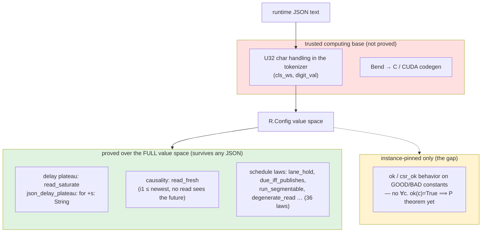
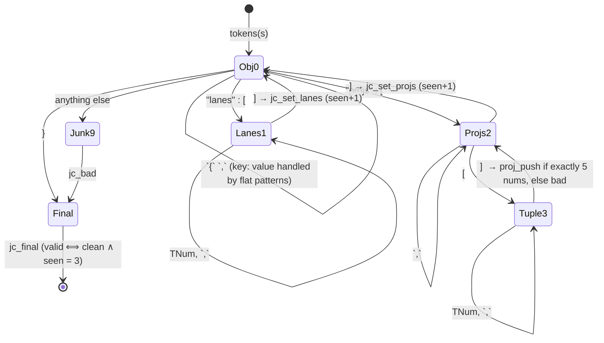
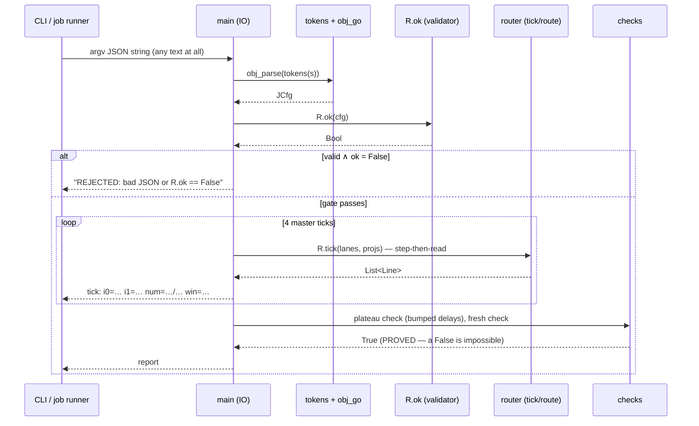
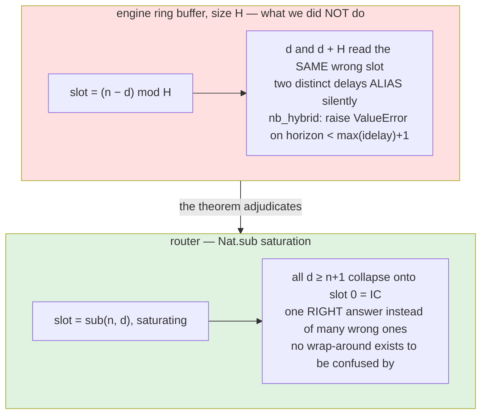

# JSON in, theorems intact — arbitrary runtime configs and the delay plateau

*tvb-bend, the Bend router worktree. Companion to the router explainer; code in `tvb_library/tvb/simulator/backend/bend_hybrid/` (`json_ingest.bend`, `LAWS_json.bend`, `PROOF_json.bend`, `json_demo.bend`).*

## The question

You proof a program, you compile it, and then **arbitrary JSON walks in through argv**. What did the proofs actually buy you at that point?

The honest answer has three tiers — and the middle tier is where the interesting work is:



Quantified laws like `for +s: String …` or `for +n: Nat …` are proved by structural induction over the **entire inhabitant set** of the type. A hostile config decoded from JSON is just one more constructor tree the induction already covered — *provenance is irrelevant to a total-function identity*. What does **not** transfer: anything only checked on concrete instances (`ok`'s laws), the text handling around the decode, and the compiler.

## The ingress pipeline (dataflow)

A strict JSON subset — whitespace-tolerant, keys in any order:

```json
{"lanes":[1,2],"projs":[[0,1,1,0,0],[1,0,2,1,0]],"horizon":4}
```

`lanes` are the subnets; each entry is the subnet's step period `k` in master ticks (subnet 0 advances every 1 tick, subnet 1 every 2). Each projection is `[src, tgt, d, win, tc]` — a routing edge with delay `d` in source samples, averaging window `win` (0 = point read), and target coupling slot `tc`. `horizon` bounds the history depth, the way `nb_hybrid` demands `horizon ≥ max(idelay)+1` to keep its ring from aliasing.

```mermaid
flowchart LR
  S["JSON string<br/>(argv, post-compile)"] --> TOK["tokens()<br/>char_cls / digit_val<br/>*TCB-ish: U32 text handling*"]
  TOK --> TS["Tok stream<br/>TBraceO TBrackO TNum TStr …"]
  TS --> OBJ["obj_go — ONE self-recursive<br/>state machine over (tokens, mode)"]
  OBJ --> JC["JCfg<br/>{lanes, projs, horizon, seen, valid}"]
  JC --> JCW["jc_final: valid ⟺ clean ∧ all 3 keys seen"]
  JCW --> CFG["jc_cfg → R.Config<br/>TOTAL decode: garbage ⇒ empty default"]
  CFG --> GATE{"json_good<br/>parse-valid ∧ R.ok"}
  GATE -- "False" --> REJ["REJECTED (the binary runs nothing else)"]
  GATE -- "True" --> RUN["lanes_run / tick / route_all"]
  RUN --> LINES["List&lt;Line&gt; — routed reads"]
  LINES --> CHECKS["runtime instances of the proofs<br/>plateau ✓ fresh ✓ (True is PROVED)"]
  style OBJ fill:#dfe8ff
  style GATE fill:#fff3d0
  style CHECKS #e0f2e0
  style CHECKS fill:#e0f2e0
```



The decoder is **total on purpose**: `json_decode : String → R.Config` never fails, so a claim quantified over `String` reaches every document the binary will ever see — including fuzz and garbage.

## The parser: one state machine, zero recursion cycles

Bend user files allow **no forward references and no mutual recursion** (Base's `String.cmp` cycle is prelude-privileged; a verbatim copy fails). The parser is therefore a single self-recursive spine whose helpers return *data* and never call back — dispatch on `(stream, state)` via one multi-scrutinee match, with flat multi-constructor token patterns:

```python
def obj_go(ts: List<&2, Tok>, m: Nat, key: String, +tacc: List<&2, Nat>,
           lacc: List<&2, Nat>, pacc: List<&2, R.Proj>, jc: JCfg) -> JCfg:
  match ts m:
    case Nil{} _:
      jc_end(m, jc)
    case TStr{+k2} <> TColon{} <> TBrackO{} <> t 0n:
      obj_go(t, key_arr_mode(k2), k2, Nil{}, lacc, pacc, jc)   # "lanes":[ …
    case TStr{+k2} <> TColon{} <> TNum{val} <> t 0n:
      obj_go(t, 0n, k2, Nil{}, lacc, pacc, jc_num_field(k2, val, jc))
    case TNum{val} <> t 1n:
      obj_go(t, 1n, key, tacc, val <> lacc, pacc, jc)          # lanes entry
    case TBrackC{} <> t 3n:
      obj_go(t, 2n, key, Nil{}, lacc, proj_push(tacc, pacc),
             jc_mark(proj_ok(tacc), jc))                       # ] ends a [src,tgt,d,win,tc]
    case _ _:
      jc_bad(jc)
```



## The runtime sequence



Actual output of the compiled binary (`bend json_demo.bend -o json_demo`), one accepted and one refused case:

```text
$ ./json_demo '{"lanes":[1,2],"projs":[[0,1,1,0,0],[1,0,2,1,0]],"horizon":4}'
ok=PASS lanes=1,2 projs=2 horizon=4
tick:  | i0=0 i1=1 num=0/1 win=0 | i0=0 i1=0 num=1/2 win=1
tick:  | i0=1 i1=2 num=0/1 win=0 | i0=0 i1=0 num=0/2 win=1
tick:  | i0=2 i1=3 num=0/1 win=0 | i0=0 i1=0 num=1/2 win=1
tick:  | i0=3 i1=4 num=0/1 win=0 | i0=0 i1=1 num=0/2 win=1
plateau (d=1+n+0 vs 1+n+9):  True True
fresh   (i1<=newest):       True

$ ./json_demo '{ "projs" : [ [ 0 , 1 , 50 , 0 , 0 ] ] , "horizon" : 64 , "lanes" : [ 2 , 3 ] }'
ok=PASS lanes=2,3 projs=1 horizon=64
tick:  | i0=0 i1=0 num=1/2 win=0     ← delay 50 on a ~2-sample history
tick:  | i0=0 i1=0 num=0/2 win=0       = the IC read, every tick
tick:  | i0=0 i1=0 num=1/2 win=0
tick:  | i0=0 i1=0 num=0/2 win=0
plateau (d=1+n+0 vs 1+n+9):  True
fresh   (i1<=newest):       True

$ ./json_demo 'not json at all!!!'
REJECTED: bad JSON or R.ok == False
```

Read the first trace against the schedule: subnet 0 (k=1) publishes every tick, so its delayed reads slide `i0=0,1,2,3` one slot per tick; subnet 1 (k=2) publishes every 2 ticks, and its read `num=1/2, 0/2, 1/2, 0/2` shows the interpolation **phase moving while the sample slots hold** — the ZOH staircase. The second trace is the plateau *on an accepted config*: a legal delay of 50 has not that many samples yet, so every read is the IC.

## The property: the delay plateau (saturation, not wrap)

The routing decision, the only place the clamp lives:

```python
def route_read(+n: Nat, +d: Nat, +num: Nat, +den: Nat, +win: Nat) -> Line:
  match d:
    case 0n:
      Line{n, n, 0n, den, win}          # zero-delay clamp (Laws.clamp_necessary)
    case 1n+dp:
      Line{Nat.sub(n, 1n+dp), Nat.sub(n, dp), num, den, win}
```

History is sample `0` (the IC) up to sample `n` (newest). A read at delay `d` asks for slots `n-d`, `n-d+1` — and `Nat.sub` **saturates at 0**. The non-intuitive consequence: every delay past the whole history (`d = 1+n+e` for any `e`) lands on the *same* line, the IC read. All absurd delays coincide.



Combined with `read_fresh` (`i1 ≤ n` for **all** `d` — reads never see the future), the pair says: in-history delays read distinct live slots, out-of-history delays collapse onto one dead slot, and nothing ever reads ahead. That is the aliasing ValueError story of the engines, dissolved into two theorems.

## The proof

```mermaid
flowchart LR
  A["sub_self_zero<br/>(n − (n+e)) = 0"] --> SAT["read_saturate<br/>∀ n num den win e1 e2"]
  B["sub_succ_self_zero<br/>(n − (1+n+e)) = 0"] --> SAT
  SAT --> BE["bump_elem<br/>per projection"]
  BE --> BP["bump_plateau<br/>fold over projs"]
  BP --> JDP["json_delay_plateau<br/>∀ String s — THE ingress law"]
  SAT -.-> RT["runtime checks in json_demo"]
  JDP -.-> RT
  I1["json_decode_instance<br/>(literal)"] -.-> PARSER["parser transcription, pinned"]
  I2["json_decode_garbage<br/>(literal)"] -.-> PARSER
  NEG["bad/bad_wrap.bend<br/>bad/bad_json_time.bend"] -. "must FAIL" --> SAT
  style JDP fill:#e0f2e0
  style NEG fill:#ffe0e0
```

The leaf property — two subtraction bricks and four rewrites; both saturating reads compute to `Line{0n, 0n, num, den, win}`:

```python
law read_saturate:
  for +n: Nat
  for +num: Nat
  for +den: Nat
  for +win: Nat
  for +e1: Nat
  for +e2: Nat
  {R.route_read(n, 1n+Nat.add(n, e1), num, den, win)
      == R.route_read(n, 1n+Nat.add(n, e2), num, den, win) : R.Line}

def sub_succ_self_zero(n: Nat, e: Nat) -> {Nat.sub(n, 1n+Nat.add(n, e)) == 0n : Nat}:
  match n:
    case 0n:
      {==}
    case 1n+p:
      sub_succ_self_zero(p, e)

def Laws.read_saturate(n, num, den, win, e1, e2):
  %Equal.sym(Nat, Nat.sub(n, 1n+Nat.add(n, e1)), 0n, sub_succ_self_zero(n, e1)) : {R.Line{_, Nat.sub(n, Nat.add(n, e1)), num, den, win} == R.route_read(n, 1n+Nat.add(n, e2), num, den, win) : R.Line}
  # … three more sym-rewrites …
  {==}
```

The ingress law — note the quantifier over `String` and the complete absence of case splits or hypotheses. This is the whole point: **the parser cannot produce a Config that escapes the plateau**, and the proof does not care what the text was:

```python
law json_delay_plateau:
  for +s: String
  for +m: Nat
  for +e1: Nat
  for +e2: Nat
  {J.run_bump(J.json_decode(s), m, e1)
      == J.run_bump(J.json_decode(s), m, e2) : List<&2, R.Line>}

# the entire proof of the ingress law:
def Laws.json_delay_plateau(s, m, e1, e2):
  bump_plateau(J.lanes_run(m, R.init_lanes(R.cfg_lanes(J.json_decode(s)))),
               R.cfg_projs(J.json_decode(s)), e1, e2)
```

Verification: `bend PROOF_json.bend --verdict` → **ALL PROOFS CHECK** (the Lean-checked BendTT kernel). Two instance laws additionally pin the parser transcription on literals (`json_decode` of a known document computes to the expected `R.Config`; garbage computes to the empty default).

### Negative controls

Proofs of false statements must fail, or the theorems are vacuous:

```python
# bad/bad_wrap.bend — "the router wraps like a ring"; MUST NOT typecheck
def bad_wrap()
    -> {R.route_read(0n, 5n, 0n, 1n, 0n) == R.Line{1n, 1n, 0n, 1n, 0n} : R.Line}:
  {==}

# bad/bad_json_time.bend — "the plateau is tick-invariant"; MUST NOT typecheck
# (it is across delays at fixed tick; the ZOH phase moves across ticks)
def bad_json_time()
    -> {J.run_bump(J.json_decode("{\"lanes\":[1,2],…}"), 3n, 0n)
          == J.run_bump(J.json_decode("{\"lanes\":[1,2],…}"), 4n, 0n)
             : List<&2, R.Line>}:
  {==}
```

Both are rejected, in `tests/run_json.sh` and in the router gate.

## What this does NOT say

- **`ok` acceptance is still instance-pinned.** There is no `∀c. ok(c)=True ⟹ P(c)` law family yet — "unreachable under ok(cfg)" comments remain informal. That is the next step (with the Python property harness attacking the decoder + `ok` boundary from outside).
- **The tokenizer's U32 text handling is in the TCB.** The laws quantify over decoded values; a `Nat` field cannot come out negative because `digit_val` builds it from digits, but that argument is prose, not proof.
- **F32 values remain uncovered by value laws** (op-order contracts only; differential testing pins values).
- **Codegen is trusted**, as always.

## Reproduce

```bash
cd tvb_library/tvb/simulator/backend/bend_hybrid
tests/run_json.sh        # proofs + negatives + pinned runtime cases
tests/run_router.sh      # the router gate (owns the 36 laws proper)
bend json_demo.bend -o json_demo && ./json_demo '{"lanes":[1,2],"projs":[[0,1,1,0,0],[1,0,2,1,0]],"horizon":4}'
```

Gotchas from building this (no forward refs in user files, state-machine spine idiom, `String.eq` not `is_eq`, …) are recorded in `NOTES.md`, the "JSON ingress" section.

*Mermaid renders in the HedgeDoc editor preview; the served page may differ — this document is also kept as `JSON_INGEST_EXPLAINER.md` in the repo.*
