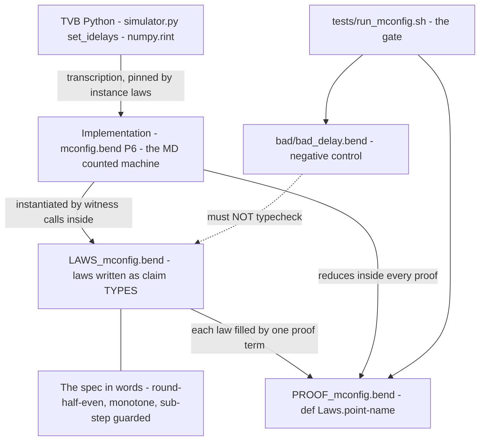
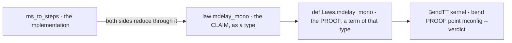

# Law, Proof, Implementation — the delay-unit slice of tvb-bend, fully annotated

Everything here is **real code** from `tvb-bend` (`tvb_library/tvb/simulator/backend/bend_hybrid/`),
one coherent slice: converting coupling delays in milliseconds to integer
source steps. It is the Bend mirror of one line of TVB Python, so every law
below has an obvious TVB meaning. Bend snippets are shown in
`python`-highlighted blocks for readability — they are Bend, not Python.

The slice answers, once and for all, what a **law**, a **proof**, and an
**implementation** are in this codebase and how they lock together:

* **implementation** — `mconfig.bend` P6: a machine that COMPUTES a number;
* **law** — `LAWS_mconfig.bend` P6: a claim written as a TYPE;
* **proof** — `PROOF_mconfig.bend` P6: a function whose RESULT TYPE is the
  claim — if it typechecks, the claim is true;
* **negative control** — `bad/bad_delay.bend`: a claim that must **NOT**
  typecheck (the "silently wrong" case made unstatable);
* **gate** — `tests/run_mconfig.sh`: the shell script that runs all of the
  above and grades the suite green/red.



---

## 1. The slice in TVB Python terms

TVB turns millisecond delays into integer multiples of the integration step
once, at setup (`tvb_library/tvb/simulator/simulator.py:264`):

```python
self.connectivity.set_idelays(self.integrator.dt)   # core: numpy.rint(delays / dt)
```

`set_idelays` fills `connectivity.idelays` with `numpy.rint(delays / dt)`.
The simulation then indexes the delayed history through those integers. Two
hazards come with that conversion, and they are exactly what the law family
pins:

1. **Off-by-rounding shifts causality silently.** A delay of 0.15 ms at
   dt 0.1 ms is 1.5 steps. Truncation gives 1, rounding gives 2. Neither the
   simulator nor the history buffer will ever complain — the causal relation
   just moved.
2. **Sub-step delays collapse onto the zero-step read.** A 0.04 ms delay at
   dt 0.1 ms is 0.4 steps and rounds to 0 — a nonzero delay silently sharing
   the zero-delay read, merging two distinct causalities on one line.

The pinned rule is `numpy.rint`'s rule, stated on exact scaled integers
(x1e6, the suite's convention for getting rationals through a JSON/U32
pipeline): with `q = floor(ms / dt)` and `r = ms mod dt`,

> **steps = q + 1  iff  `2r > dt`, or `2r == dt` and `q` is odd**
> (round-half-to-EVEN — ties round to the even neighbour)

so 0.5 steps → 0 (even), 1.5 steps → 2 (even), 0.4 → 0, 0.75 → 1.

---

## 2. The implementation, line by line (`mconfig.bend` P6)

### 2.1 Why a machine and not a formula

The obvious implementation is `steps = rint(ms / dt)` as a closed form. It is
useless here for two documented reasons (the code says so in its header
comment): the BendTT kernel keeps **F32 opaque** (float arithmetic never
reduces — see §7), and a `divmod` closed form **does not normalise on
symbolic arguments**, so a quantified law like "monotone for all ms1 ≤ ms2"
could never be proved over it. Instead the conversion is a **counted
machine**: one O(1) tick per scaled millisecond, each tick adding 0 or 1 to
an accumulator. `s' = s` or `1+s` is precisely the shape a structural
induction can chew.

### 2.2 The state record and its accessors

```python
type MD is Data:
  MD{q: Nat, wd: Nat, ad: Nat, ar: Bool, s: Nat, h: Nat}
```

* `type MD is Data:` — declares `MD` a **record type** (`Data` = a
  product/struct; fields are linear, i.e. single-owner — see the `+` notes
  below).
* `MD{...}` — the constructor; the six fields, each documented where it is
  used, are:
  * `q` — the current **chunk quotient**: how many full `dt`-chunks have
    elapsed. Grows by 1 at every wrap. (The quotient of `divmod(ms, dt)` in
    flight.)
  * `wd` — **wrap-down counter**: ticks remaining until the current chunk
    ends. Reloaded to `dt-1` at each wrap.
  * `ad` — **boundary countdown**: ticks remaining until this chunk's
    rounding boundary. Reloaded at each wrap to `b0(...)` (§2.3).
  * `ar` — **armed flag**: is a boundary still pending in this chunk? After
    the boundary fires it disarms (and re-arms at the next wrap).
  * `s` — **the answer**: the rounded step count accumulated so far.
  * `h` — a constant, `floor(dt / 2)`, computed once at `md_init` and read
    by `b0` (records are single-owner, so a config value that is read every
    tick must be carried in the state — hence its presence here).

```python
def m_q(+m: MD) -> Nat:
  match m:
    case MD{q, wd, ad, ar, s, h}:
      q
```

(and identically `m_wd`, `m_ad`, `m_ar`, `m_s`, `m_h`)

* **Bend has no field-access syntax.** Every field read is its own one-line
  function that pattern-matches the record and returns the field. That is
  why six trivial accessors exist.
* `def m_q(+m: MD) -> Nat:` — function `m_q`, argument `m` of type `MD`,
  returns `Nat`.
* `+m` — the `+` marks the argument **unrestricted** (may be read without
  being consumed; duplicable/discardable). Without `+`, a `Data` argument is
  **linear**: it must be used exactly once. The accessors drop five of the
  six fields, so they need `+`.
* `match m: case MD{...}: q` — destructures `m` (a `match` may only inspect
  **parameters or pattern bindings**, never a computed value — a Bend rule
  that shapes the whole codebase) and the case body's value (`q`) is the
  return value.

### 2.3 O(1) structural tests and the boundary offset

```python
def odd(q: Nat) -> Bool:
  match q:
    case 0n:
      False{}
    case 1n+p:
      Bool.not(odd(p))
```

* `Nat` is **unary** (Peano) here: `0n` is zero, `1n+p` is the successor
  pattern — "1 + p", binding `p` to the predecessor. `200n` is literal
  syntax for a unary 200.
* Recursion **is** the loop construct. The termination checker wants the
  first CHANGED argument to shrink: here the matched `q` shrinks to `p`.
  `odd` computes parity structurally — no value comparison anywhere.

```python
def is_zero(x: Nat) -> Bool:
  match x:
    case 0n:
      True{}
    case 1n+p:
      False{}

def pred01(x: Nat) -> Nat:
  match x:
    case 0n:
      0n
    case 1n+p:
      p
```

* `True{}`/`False{}` — the `Bool` constructors (the `{}` is empty-field
  constructor syntax).
* `pred01` — predecessor floored at 0 (a saturating decrement). The header
  comment explains the design rule these two embody: **no `Nat.compare`
  inside the machine loop** — a value comparison would itself recurse over
  the counters' magnitudes and explode the kernel reduction. Only O(1)
  structural tests (`is_zero`, `odd`) are allowed in `mstep`.

```python
def half01_go(rem: Nat, +tk: Bool, +acc: Nat) -> Nat:
  match rem:
    case 0n:
      acc
    case 1n+p:
      half01_go(p, Bool.not(tk), Bool.pick(Nat, tk, 1n+acc, acc))

def half01(x: Nat) -> Nat:
  half01_go(x, False{}, 0n)
```

* `half01(x) = floor(x / 2)` — computed structurally (counting by 2s:
  every second tick increments `acc`). `rem` is the shrinking fuel, `+tk` a
  toggle flag, `+acc` the accumulator.
* `Bool.pick(Nat, tk, 1n+acc, acc)` — the if-then-else: `Bool.pick(TYPE,
  cond, when-true, when-false)`. There is no `if` in Bend; `Bool.pick`
  (or a `match` on the `Bool`) is the conditional. The type argument
  (`Nat`) is required because operators demand explicit types.
* It exists because symbolic `Nat.div` gets stuck in the kernel (§7).

```python
def b0(+h: Nat, +dt: Nat, +q: Nat) -> Nat:
  Bool.pick(Nat, odd(dt), h,
            Bool.pick(Nat, odd(q), Nat.sub(h, 1n), h))
```

* `b0` — the chunk's **boundary offset**: where inside a `dt`-tick chunk the
  rounding boundary sits. Odd `dt` has no ties (boundary at fraction
  `(dt+1)/2` → offset `h`). Even `dt` has a tie at fraction `dt/2`: an ODD
  quotient rounds up there (offset `h-1`), an EVEN quotient rounds down —
  that IS half-to-even — so no boundary is needed at `h-1`, only at `h`.
  (The file comment derives and cross-checks this against the reference for
  `dt` in 1..60.)
* `Nat.sub(h, 1n)` — truncated subtraction (`0 - 1 = 0`).
* Nested `Bool.pick` reads as if/else-if.

### 2.4 One tick, and the driver

```python
def mstep(+dt: Nat, +st: MD) -> MD:
  MD{
    Bool.pick(Nat, is_zero(m_wd(st)), 1n+m_q(st), m_q(st)),
    Bool.pick(Nat, is_zero(m_wd(st)), Nat.sub(dt, 1n), pred01(m_wd(st))),
    Bool.pick(Nat, is_zero(m_wd(st)),
              b0(m_h(st), dt, 1n+m_q(st)),
              Bool.pick(Nat, Bool.and(m_ar(st), is_zero(m_ad(st))), 0n,
                        Bool.pick(Nat, m_ar(st), pred01(m_ad(st)), m_ad(st)))),
    Bool.pick(Bool, is_zero(m_wd(st)), True{},
              Bool.pick(Bool, Bool.and(m_ar(st), is_zero(m_ad(st))), False{}, m_ar(st))),
    Bool.pick(Nat, Bool.and(m_ar(st), is_zero(m_ad(st))), 1n+m_s(st), m_s(st)),
    m_h(st)}
```

One master tick = one scaled millisecond. Field by field (constructor
arguments are positional, in the `MD{...}` declaration order):

1. `q'` — if the chunk just ended (`wd == 0`): quotient grows by 1;
   otherwise unchanged.
2. `wd'` — at a wrap reload to `dt - 1` (a fresh chunk holds `dt` ticks, one
   is the current); otherwise saturating decrement.
3. `ad'` — at a wrap, **rearm** the boundary at the NEW chunk's offset
   `b0(h, dt, q+1)` (the new quotient decides tie behaviour!); otherwise, if
   the boundary fires now (`ar and ad == 0`) park `ad` at 0; otherwise
   decrement while armed, hold while disarmed.
4. `ar'` — at a wrap, (re)arm; on a fire, disarm; else hold.
5. `s'` — **the rounding happens here**: `s + 1` exactly when the armed
   boundary is due (`ar and ad == 0`), else `s`. The whole rounding rule
   lives in *which ticks* this predicate holds.
6. `h'` — constant, carried unchanged.

```python
def md_go(left: Nat, +dt: Nat, +st: MD) -> MD:
  match left:
    case 0n:
      st
    case 1n+p:
      md_go(p, dt, mstep(dt, st))

def md_init(+dt: Nat) -> MD:
  MD{0n, Nat.sub(dt, 1n), half01(dt), True{}, 0n, half01(dt))

def ms_at(+ms: Nat, +dt: Nat) -> MD:
  md_go(ms, dt, md_init(dt))

def at_next(+st: MD) -> Bool:
  Bool.and(m_ar(st), is_zero(m_ad(st)))

def ms_to_steps(+ms: Nat, +dt: Nat) -> Nat:
  m_s(ms_at(ms, dt))
```

* `md_go` — the loop driver: `left` ticks to go (fuel-first so the
  termination checker sees the shrink), `+dt` the step size, `+st` the
  threaded state. Note `st` is returned/forwarded, never duplicated —
  single-owner threading.
* `md_init(dt)` — the state before tick 0: `q=0`, `wd=dt-1`,
  `ad=ar=h=floor(dt/2)` armed, `s=0`.
* `ms_at(ms, dt)` — the full state after `ms` ticks. Laws read its fields.
* `at_next(st)` — "does the boundary fire on the NEXT tick?" (armed and due).
* **`ms_to_steps(ms, dt)` — THE CONVERSION.** Arg `ms` = the delay in scaled
  milliseconds, `dt` = the (scaled) source step. Returns the rounded source
  steps. This is the Bend counterpart of `numpy.rint(delays / dt)`.

### 2.5 The validator (`md_ok`) — policy on top of the rule

```python
def dts_ok(dts: List<&2, Nat>) -> Bool:
  match dts:
    case Nil{}:
      True{}
    case h <> t:
      Bool.and(Nat.is_ge(h, 1n), dts_ok(t))
```

* `List<&2, Nat>` — a list of `Nat`. `&2` is a **usage annotation** on the
  elements: unrestricted (the default here would be linear/single-owner).
  `Nil{}` is the empty list, `h <> t` the cons pattern (head `h`, tail `t`).
* `Nat.is_ge(h, 1n)` — a `Bool`-returning comparison. Two ways to say "≤ /
  ≥" coexist in this codebase and knowing when each is used is the key to
  law-vs-proof: `Nat.is_le/is_ge/...` return **Bools** (for claims ABOUT
  computed values), while `R.le_ok(a, b)` is a **witness type** (for
  quantified hypotheses — see law 3).
* `dts_ok`: every integration step is non-zero (a zero `dt` would make
  conversion meaningless).

```python
def msd_row_ok(+dts: List<&2, Nat>, +msds: List<&2, Nat>, +p: R.Proj, +i: Nat) -> Bool:
  Bool.or(Nat.is_eq(R.nats_nth(msds, i), 0n),
          Nat.is_ge(ms_to_steps(R.nats_nth(msds, i), R.nats_nth(dts, R.proj_src(p))), 1n))

def mdels_ok_at(+dts: List<&2, Nat>, +msds: List<&2, Nat>,
                ps: List<&2, R.Proj>, +i: Nat) -> Bool:
  match ps:
    case Nil{}:
      True{}
    case h <> t:
      Bool.and(msd_row_ok(dts, msds, h, i),
               mdels_ok_at(dts, msds, t, Nat.add(i, 1n)))

def mdels_ok(+dts: List<&2, Nat>, +msds: List<&2, Nat>,
             +ps: List<&2, R.Proj>) -> Bool:
  mdels_ok_at(dts, msds, ps, 0n)
```

* `msd_row_ok` — projection `p`'s rule: its ms delay is either **exactly 0**
  (no delay — fine), or must convert to **≥ 1 step**. Arg `+i` is the
  projection's index into the parallel lists (`msds[i]` its delay); the
  conversion uses `dts[R.proj_src(p)]` — **the SOURCE lane's dt**, because
  the delayed read is taken from the source's history. A nonzero delay
  rounding to 0 steps is REJECTED here — hazard 2 of §1, made unstatable.
* `mdels_ok_at` — folds that rule over the projection list with a running
  index `i` (the suite's parallel-list "nth convention").
* `Bool.or` / `Bool.and` — plain boolean connectives.

```python
def md_ok(+dts: List<&2, Nat>, +msds: List<&2, Nat>, +c: R.Config) -> Bool:
  Bool.and(Nat.is_eq(R.nats_len(dts), R.nats_len(R.cfg_lanes(c))),
  Bool.and(Nat.is_eq(R.nats_len(msds), R.projs_len(R.cfg_projs(c))),
  Bool.and(dts_ok(dts),
  Bool.and(mdels_ok(dts, msds, R.cfg_projs(c)),
           R.ok(c)))))
```

* `md_ok(dts, msds, c)` — THE DELAY VALIDATOR. Accepts iff: (a) one dt per
  lane, (b) one ms delay per projection, (c) every dt ≥ 1, (d) every nonzero
  delay converts to ≥ 1 step at its source lane's dt, (e) the base network
  config passes the router's own validator `R.ok(c)` (the layers gate on
  each other — `R.Config` here is the router's plain config type, `c` it).
* The right-nested `Bool.and` chain is the idiomatic multi-conjunct form
  (Bend expressions are single terms; nesting encodes the tuple).

### 2.6 Python equivalent of the implementation

```python
import numpy as np

def ms_to_steps(ms: int, dt: int) -> int:
    """Round-half-even conversion of a scaled-ms delay to source steps.
    Exact-rational mirror of numpy.rint(delays / dt) as used by TVB's
    connectivity.set_idelays -- on scaled integers there is no float
    tie ambiguity at all."""
    q, r = divmod(ms, dt)
    return q + 1 if (2 * r > dt or (2 * r == dt and q % 2 == 1)) else q


def md_ok(dts, msds, config) -> bool:
    ok  = len(dts) == len(config.lanes) and len(msds) == len(config.projs)
    ok &= all(d >= 1 for d in dts)
    for proj, ms in zip(config.projs, msds):
        ok &= (ms == 0) or (ms_to_steps(ms, dts[proj.src]) >= 1)
    return ok and router_ok(config)
```

---

## 3. The laws (five, in TVB language) and how each proof works

A **law** is a claim written as a type — `{ LEFT == RIGHT : T }` says "the
term LEFT and the term RIGHT, both of type T, are structically equal". A
**proof** is a function whose result type is that claim; its body must
typecheck, and the kernel is the referee. If a definition fills the law, the
claim is a theorem.



Worth internalising: **instance laws are proved by `{==}` alone** (both sides
compute to the same literal — the kernel evaluates the machine), while
**quantified laws need symbolic proofs** (induction over the machine, §3.3).
Both are shown below.

### Law 1 — `mdelay_exact` (and its off-by-rounding foil `mdelay_round_up`)

**TVB meaning.** A delay of exactly k integration steps converts to k — and
a 1.5-step delay converts to 2, NOT to 1: rounding, not truncation. (Hazard
1 of §1.)

**The law** (`LAWS_mconfig.bend`):

```python
# the exact-division case: 0.2 ms at dt 0.1 ms is 2.0 ratios -> 2 steps
law mdelay_exact:
  {M.ms_to_steps(200n, 100n) == 2n : Nat}

# the OFF-BY-ROUNDING witness: 0.15 ms at dt 0.1 ms is exactly 1.5
# ratios, the ODD quotient rounds up -> 2 steps (truncation would give 1)
law mdelay_round_up:
  {M.ms_to_steps(150n, 100n) == 2n : Nat}
```

* `law NAME:` — declares a claim. The body is one expression of type
  `{ LEFT == RIGHT : T }` — the **claim type**.
* `M.ms_to_steps` — the implementation, imported (`import
  ../mconfig.bend as M`). The law is stated OVER the implementation — that
  is what makes it a fidelity pin rather than a wish.
* `200n, 100n` — x1e-3-scaled witnesses of the nominal x1e6 values (0.2 ms,
  0.1 ms). Same ratio; see §7 on witness budgets. The law pins the RATIO.

**The proof** (`PROOF_mconfig.bend`):

```python
def Laws.mdelay_exact():
  {==}
```

* `def Laws.NAME():` — the naming convention binds a proof to `law NAME`.
* `{==}` — **structural reflexivity**: the proof constructor that succeeds
  when both sides of the claim reduce to the same term. Here that means the
  kernel runs the machine 200 ticks and gets `2`, matching `2n`. Literal
  computation IS the proof.

**Python / unit test.**

```python
def test_mdelay_exact_and_round_up():
    assert ms_to_steps(200, 100) == 2     # 2.0 -> 2, exact
    assert ms_to_steps(150, 100) == 2     # 1.5 -> 2, odd quotient rounds UP
    assert np.rint(150 / 100) == 2        # same answer in numpy-land
```

### Law 2 — `mdelay_tie` (the rounding-rule discriminator)

**TVB meaning.** Ties round half to EVEN (`numpy.rint`), not half up. A
0.5-step delay converts to 0, not 1. If a future refactor swaps in
`floor(x + 0.5)`, this law turns red.

**The law:**

```python
# the TIE witness: 0.05 ms at dt 0.1 ms is exactly 0.5 ratios, and
# half-to-even rounds the EVEN quotient down -> 0 steps (round-half-UP
# would give 1)
law mdelay_tie:
  {M.ms_to_steps(50n, 100n) == 0n : Nat}
```

**The proof:** `def Laws.mdelay_tie(): {==}` — again literal computation.
Note what the machine must therefore get right: for `dt = 100`, chunk 0 has
quotient 0 (even), so the tie at offset `h-1 = 49` must NOT fire — that is
`b0`'s `odd(q)` arm. The law tests the rounding rule THROUGH the machine,
including its tie schedule.

**Python / unit test.**

```python
def test_mdelay_tie_half_even():
    assert ms_to_steps(50, 100) == 0      # 0.5 -> 0 (even), rint agrees
    assert ms_to_steps(150, 100) == 2     # 1.5 -> 2 (even), rint agrees
    assert np.rint(0.5) == 0.0 and np.rint(1.5) == 2.0
```

### Law 3 — `mdelay_mono` (quantified: causality cannot silently reorder)

**TVB meaning.** For ALL delays and steps: a longer ms delay never converts
to FEWER source steps. The causality order of the network's connections is
preserved by the conversion — no parameter tweak can reorder reads.

**The law:**

```python
law mdelay_mono:
  for +ms1: Nat
  for +ms2: Nat
  for +dt: Nat
  for h: R.le_ok(ms1, ms2)
  {Nat.is_le(M.ms_to_steps(ms1, dt), M.ms_to_steps(ms2, dt)) == True{} : Bool}
```

* `for +ms1: Nat` — universally quantified binder (unrestricted). The claim
  must hold for every `Nat`.
* `for h: R.le_ok(ms1, ms2)` — the **hypothesis as an argument**: the law is
  only obligated for pairs with `ms1 ≤ ms2`, witnessed by `h`. `le_ok(a,b)`
  is the inductive **witness type** for ≤ (its inhabitant IS the evidence:
  zero is ≤ anything; `1+p ≤ 0` is uninhabited — the `Empty` case; `1+p ≤
  1+q` peels to `p ≤ q`). This is the "decider-witness form": the premise
  rides along as data the proof can pattern-match on.
* The claim itself is a `Bool` computation (`Nat.is_le(...) == True{}`) —
  value-level ≤ between two computed step counts.

**The proof** — this is the machinery section, so it gets full treatment.
Three pieces:

```python
# pick arms: s or 1+s -- the machine's step can only keep or grow
def s_le_pick(s: Nat, js: Bool)
    -> {Nat.is_le(s, Bool.pick(Nat, js, 1n+s, s)) == True{} : Bool}:
  match js:
    case True{}:
      le_succ(s)
    case False{}:
      le_refl(s)
```

* Result type `-> { CLAIM : T }` — the proof's TYPE is the claim. A proof is
  a function whose *type signature is the theorem statement*.
* The proof destructs the `Bool` pick: in the true arm the claim is `s ≤
  1+s` (`le_succ`), in the false arm `s ≤ s` (`le_refl`) — both re-derived
  locally in two lines because **filled laws do not re-export across
  modules** in Bend (each proof file re-brings its bricks; see `le_refl`,
  `le_succ`, `ne_succ_local` in the source).

```python
def tick_le(+dt: Nat, +st: M.MD)
    -> {Nat.is_le(M.m_s(st), M.m_s(M.mstep(dt, st))) == True{} : Bool}:
  s_le_pick(M.m_s(st), M.at_next(st))
```

* `tick_le` — one tick never decreases `s`. It needs NO case analysis:
  `m_s(mstep(dt, st))` **definitionally reduces** to
  `pick(at_next(st), 1n+m_s(st), m_s(st))` — the kernel unfolds `mstep` — so
  `s_le_pick` applies directly. This is the payoff of writing `mstep` in the
  pick shape (§2.1).

```python
def run_grow(left: Nat, +dt: Nat, +st: M.MD)
    -> {Nat.is_le(M.m_s(st), M.m_s(M.md_go(left, dt, st))) == True{} : Bool}:
  match left:
    case 0n:
      le_refl(M.m_s(st))
    case 1n+(+p):
      PR.le_trans_go(M.m_s(st), M.m_s(M.mstep(dt, st)),
                     M.m_s(M.md_go(p, dt, M.mstep(dt, st))),
                     tick_le(dt, st), run_grow(p, dt, M.mstep(dt, st)))
```

* Structural induction on `left`: zero ticks changes nothing (`le_refl`);
  `1+p` ticks = one `mstep` then `p` more, and `≤` composes through
  `PR.le_trans_go(a, b, c, a≤b, b≤c)`. `1n+(+p)` — the `+` on the binder
  makes `p` unrestricted (the recursive call and the proof both need it
  patterns). This lemma is state-general: running ticks from ANY state only
  grows `s`.

```python
def run_mono_tick(n1: Nat, n2: Nat, h: R.le_ok(n1, n2), +dt: Nat, +st: M.MD)
    -> {Nat.is_le(M.m_s(M.md_go(n1, dt, st)),
                  M.m_s(M.md_go(n2, dt, st))) == True{} : Bool}:
  match n1 n2 h:
    case 0n _ h:
      run_grow(n2, dt, st)
    case 1n+p 0n h:
      Empty.absurd({Nat.is_le(M.m_s(M.md_go(1n+p, dt, st)),
                              M.m_s(M.md_go(0n, dt, st))) == True{} : Bool}, h)
    case 1n+p 1n+q h:
      run_mono_tick(p, q, h, dt, M.mstep(dt, st))
```

* The core: **double-countdown monotonicity** — from any state, `n1 ≤ n2`
  ticks give `steps(n1) ≤ steps(n2)`. Proven by induction riding the
  witness `h`.
* `match n1 n2 h:` — **multi-scrutinee match**: all three scrutinees must be
  constructors simultaneously (a Bend rule).
* `case 0n _ h:` — `n1 = 0`, `n2` anything: `steps(0) ≤ steps(n2)` is
  exactly `run_grow`. `_` is the wildcard.
* `case 1n+p 0n h:` — `n1 = 1+p ≤ 0` is impossible: `h` has type
  `le_ok(1n+p, 0n)` which is the **empty type**. `Empty.absurd(CLAIM, h)`
  discharges the branch: from a proof of falsehood, anything. This is how
  impossible causality states are eliminated — the premise is *typed*.
* `case 1n+p 1n+q h:` — both successors: `le_ok` peels to
  `h : le_ok(p, q)`; both countdowns step one tick (`mstep`) and the
  induction hypothesis closes it. Each recursive call's first CHANGED
  argument (`p`, `q`) shrinks — termination discipline again.

Finally the law itself is one instantiation:

```python
def Laws.mdelay_mono(ms1, ms2, dt, h):
  run_mono_tick(ms1, ms2, h, M.md_init(dt))   # (args abbreviated)
```

Bind the quantifiers (`ms1, ms2, dt, h`) and start the machine at `md_init`.
The law's universally-quantified statement is proved for all values at once —
this is the difference between "checked on examples" and "proved".

**Python / unit test** (exhaustive where Python can afford it):

```python
def test_mdelay_mono_quantified_feasible():
    for dt in range(1, 60):
        for ms2 in range(0, 200):
            for ms1 in range(0, ms2 + 1):
                assert ms_to_steps(ms1, dt) <= ms_to_steps(ms2, dt)
```

### Law 4 — `mdelay_cross` (strict increase exactly at boundary ticks)

**TVB meaning.** Wherever the rounding rule says a boundary fires, adding one
more scaled millisecond MUST add one source step — a boundary can never be
silently absorbed. (Honest limit: half-to-even has plateaus — 1.5 and 2.5
both give 2 — so strict increase is NOT true everywhere; it is true exactly
where `at_next` holds. The law states precisely that.)

**The law:**

```python
law mdelay_cross:
  for +ms1: Nat
  for +dt: Nat
  for +hjs: {M.at_next(M.ms_at(ms1, dt)) == True{} : Bool}
  {Nat.is_ne(M.ms_to_steps(ms1, dt),
             M.ms_to_steps(Nat.add(ms1, 1n), dt)) == True{} : Bool}
```

* `for +hjs: { M.at_next(...) == True{} : Bool }` — a **claim-typed
  hypothesis binder**: the law is only obligated at ms values whose NEXT
  tick is a boundary. Proof obligations can be scoped by other proof
  obligations.

**The proof** (sketch of the full term in the source):

```python
def Laws.mdelay_cross(ms1, dt, hjs):
  +st1 = M.ms_at(ms1, dt)
  +e1 = comp_go(ms1, 1n, dt, M.md_init(dt))
  +eA = Equal.trans(Nat, ... )      # eA : steps(ms1+1) == 1 + steps(ms1)
  Equal.trans(Bool, ... )           # rewrite the claim and close with ne_succ_local
```

* `+st1 = ...` — a let-binding (`+` = unrestricted use below).
* `comp_go(a, b, dt, st)` proves the **tick composition** lemma
  `md_go(a+b) == md_go(b) ∘ md_go(a)` by induction on `a`, using
  `Equal.trans(T, x, y, z, x==y, y==z)` — transitivity of the claim's `==`
  (three terms, two sub-proofs). This converts "one more tick" into "one
  `mstep` from the known state".
* `Equal.cong(T, U, f, a, b, p)` — **congruence**: from `a == b` conclude
  `f(a) == f(b)`. Here `x => M.m_s(x)` (a lambda — `x => body`) lifts a
  state equality to a step-count equality, and
  `x => Bool.pick(Nat, x, 1n+M.m_s(st1), M.m_s(st1))` uses the hypothesis
  `hjs : at_next(st1) == True{}` to rewrite the pick onto its `1n+` arm —
  that is where the "+1 actually lands" becomes visible in the term.
* The final `Equal.trans(Bool, ..., PR.ne_symm(..., ne_succ_local(...)))`
  converts `steps(ms1+1) == 1 + steps(ms1)` into the claim
  `is_ne(steps(ms1), steps(ms1+1)) == True{}` (`n ≠ 1+n`).

**Python / unit test:**

```python
def test_mdelay_cross_strict_at_boundaries():
    for dt in range(1, 40):
        for ms in range(0, 120):
            q, r = divmod(ms, dt)
            at_next = (2 * r == dt and q % 2 == 1) or (2 * r + 1 == dt and dt % 2 == 1) or ...
            # reference definition: a boundary fires on the next tick iff
            ms_to_steps(ms, dt) + 1 == ms_to_steps(ms + 1, dt)   # the claim
            # so test its premise-true points exhaustively:
            if boundary_fires_at(ms + 1, dt):     # helper mirroring at_next
                assert ms_to_steps(ms, dt) + 1 == ms_to_steps(ms + 1, dt)
```

(The `boundary_fires_at` helper is the Python rendering of `at_next ∘
ms_at` — the machine's schedule predicate. In the Bend proof this predicate
is never computed — it is a HYPOTHESIS that rewrites the pick. In Python you
can just test the observable.)

### Law 5 — `md_ok_good` / `md_ok_bad_substep` (the validator pair)

**TVB meaning.** The getting-started network (two lanes at dt 0.1 ms, one
projection with a 0.2 ms coupling delay) is accepted; the same network with a
0.04 ms delay is REJECTED. 0.04 ms rounds to 0 steps — a nonzero delay may
not collapse onto the zero-delay read.

**The laws:**

```python
def GOOD_DTS() -> List<&2, Nat>:
  100n <> 100n <> Nil{}

def GOOD_MSDS() -> List<&2, Nat>:
  200n <> Nil{}

def SUBSTEP_MSDS() -> List<&2, Nat>:
  40n <> Nil{}

law md_ok_good:
  {M.md_ok(GOOD_DTS(), GOOD_MSDS(), GOOD_C()) == True{} : Bool}

law md_ok_bad_substep:
  {M.md_ok(GOOD_DTS(), SUBSTEP_MSDS(), GOOD_C()) == False{} : Bool}
```

* Witness functions (`GOOD_DTS` etc.) — the family convention: named
  constants as zero-arg defs (`()` = no args; laws call them). `<>` cons
  syntax builds the lists. `GOOD_C()` is the demo network config (two
  lanes, one projection — defined at the top of the file).
* The pair pins the validator in both directions — green AND red. The red
  pin is as load-bearing as the green: it proves the guard is not
  vacuously true.

**The proofs:** `def Laws.md_ok_good(): {==}` and
`def Laws.md_ok_bad_substep(): {==}` — literal computation through the
validator folds.

**Python / unit test:**

```python
def test_md_ok_accepts_rejects():
    cfg = Config(lanes=[1, 1], projs=[Proj(src=0, tgt=1)])
    assert     md_ok([100, 100], [200], cfg)   # 0.2 ms -> 2 steps, fine
    assert not md_ok([100, 100], [ 40], cfg)   # 0.04 ms -> 0 steps, REJECTED
```

---

## 4. The negative control (`bad/bad_delay.bend`) — a claim that must FAIL

```python
# NEGATIVE CONTROL -- this file MUST NOT typecheck.  ...
# The conversion rounds 0.04/0.1 = 0.4 ratios to **0 source steps**, so
# md_ok's step-coverage conjunct computes is_ge(0, 1) = False.  ...
import Base
import ../mconfig.bend as M
import ../router.bend as R

def bad_delay()
  -> {M.md_ok(100n <> 100n <> Nil{},
              40n <> Nil{},
              R.Config{1n <> 1n <> Nil{},
                       R.Proj{0n, 1n, 0n, 0n, 0n} <> Nil{},
                       1n})
       == True{} : Bool}:
  {==}
```

* Same shape as a proof — but it CLAIMS the sub-step network is ACCEPTED.
  The body `{==}` demands the two sides be structurally equal; they compute
  to `False{}` vs `True{}`, so the file does NOT typecheck. In this suite,
  "does not typecheck" is a test PASSING.
* `R.Proj{0n, 1n, 0n, 0n, 0n}` — the router's projection record (source
  lane 0, target lane 1, …).
* The gate runs `bend bad/bad_delay.bend` and requires failure. (Lesson
  from the trenches, encoded in our gates: verify a negative control fails
  AT ITS CLAIM, not at an import typo — a bad file that fails for the wrong
  reason is a false green.)

---

## 5. Consolidated Python module + test file

```python
"""delay_units.py -- numpy-land mirror of the Bend P6 delay-unit slice."""
import numpy as np


def ms_to_steps(ms: int, dt: int) -> int:
    """round-half-even(ms / dt) on exact scaled integers (TVB x1e6 convention)."""
    q, r = divmod(ms, dt)
    return q + 1 if (2 * r > dt or (2 * r == dt and q % 2 == 1)) else q


def ms_to_steps_rint(ms: np.ndarray, dt: float) -> np.ndarray:
    """The one-liner TVB actually runs (float ties must be exact)."""
    return np.rint(ms / dt).astype(np.int64)


def boundary_fires_at(k: int, dt: int) -> bool:
    """at_next(ms_at(k-1, dt)) -- does tick k cross a rounding boundary?"""
    return ms_to_steps(k, dt) == ms_to_steps(k - 1, dt) + 1 if k > 0 else False


def md_ok(dts, msds, cfg) -> bool:
    ok = len(dts) == len(cfg.lanes) and len(msds) == len(cfg.projs)
    ok = ok and all(d >= 1 for d in dts)
    ok = ok and all((ms == 0) or (ms_to_steps(ms, dts[p.src]) >= 1)
                    for p, ms in zip(cfg.projs, msds))
    return ok and router_ok(cfg)
```

```python
"""test_delay_units.py -- pytest."""
import numpy as np
import pytest
from delay_units import ms_to_steps, ms_to_steps_rint, boundary_fires_at, md_ok


def test_exact():            assert ms_to_steps(200, 100) == 2
def test_tie_even_down():    assert ms_to_steps( 50, 100) == 0
def test_tie_odd_up():       assert ms_to_steps(150, 100) == 2
def test_fractional():       assert ms_to_steps( 75, 100) == 1
def test_substep():          assert ms_to_steps( 40, 100) == 0
def test_tvb_dt01():         assert ms_to_steps(300, 100) == 3
def test_tvb_dt05():         assert ms_to_steps(500, 500) == 1
def test_lattice_distinct(): assert ms_to_steps(100, 100) != ms_to_steps(200, 100)


def test_mono_quantified():                       # mdelay_micro + mdelay_mono
    for dt in range(1, 60):
        prev = -1
        for ms in range(0, 200):
            s = ms_to_steps(ms, dt)
            assert prev <= s
            prev = s


def test_cross_at_boundaries():                   # mdelay_cross
    for dt in range(1, 40):
        for k in range(1, 150):
            if boundary_fires_at(k, dt):
                assert ms_to_steps(k - 1, dt) + 1 == ms_to_steps(k, dt)


def test_agrees_with_numpy_rint():                # the transcription pin
    ms = np.arange(0, 400)
    for dt in (1, 2, 3, 5, 10, 25, 50, 100):
        got = [ms_to_steps(int(m), dt) for m in ms]
        np.testing.assert_array_equal(got, ms_to_steps_rint(ms, dt))


class TestValidator:
    cfg = ...  # two lanes, one projection (src 0 -> tgt 1)

    def test_good(self):     assert     md_ok([100, 100], [200], self.cfg)
    def test_substep(self):  assert not md_ok([100, 100], [ 40], self.cfg)
    def test_zero_dt(self):  assert not md_ok([100,   0], [200], self.cfg)
    def test_lengths(self):  assert not md_ok([100],       [200], self.cfg)
```

Run with `pytest test_delay_units.py`.

---

## 6. How the whole thing is graded (the gate)

```bash
export PATH="$HOME/.local/bin:$PATH"        # lean, for --verdict
cd tvb_library/tvb/simulator/backend/bend_hybrid
bend PROOF_mconfig.bend                     # fill every law (plain check)
bend PROOF_mconfig.bend --verdict           # the BendTT KERNEL re-checks
bash tests/run_mconfig.sh                   # family gate: verdict + negatives + smoke
```

Expected: `ALL PROOFS CHECK` from both bend runs, `all green` from the gate,
and each `bad/*.bend` reported `(rejected)`. The kernel pass is not
decorative: it is a second, stricter checker (a dependent-type kernel)
re-verifying every claim the fast checker accepted.

---

## 7. What cannot be proved here (and where it is checked instead)

* **F32 is opaque to the kernel.** `F32.add(0.0, 0.0) == 0.0` does NOT
  reduce — measured on bend 2.0.34. No float VALUE claim is provable in
  this system. That is why the whole slice lives on scaled integers, and
  why genuinely numeric claims (the float kernel's parity with numba) live
  in the `compare_*.py` scripts — a division of labour, not a gap.
* **Symbolic `divmod` gets stuck.** The quantified laws are provable BECAUSE
  the implementation is the tick machine (`s' = s` or `1+s`) and not a
  division formula. Designing the implementation to fit the proof system is
  part of the craft here.
* **Half-even has plateaus.** 1.5 and 2.5 both round to 2, so strict
  monotonicity is false in general — `mdelay_cross` carries its `at_next`
  hypothesis for exactly this reason. Laws state what is TRUE, with the
  honest scope condition typed in.
* **Witness budgets.** Instance witnesses use x1e-3-scaled values (e.g.
  `200n` for 0.2 ms at 0.1 ms): the machine's cost is linear in the scaled
  ms, and huge literals blow the kernel-verification budget. The laws pin
  RATIOS, which is what the rule is about.

---

## 8. Syntax glossary (everything used above)

| Token / form | Meaning |
|---|---|
| `type MD is Data:` | declare a record (product) type; fields are linear |
| `MD{a: T, ...}` | the record constructor |
| `def f(x: T) -> U:` | function `f`, argument `x: T`, result `U` |
| `def f():` | zero-argument definition (witness constants, literal proofs) |
| `+x: T` | argument/binder is UNRESTRICTED (duplicable, discardable); without `+`, `Data` values are linear — used exactly once |
| `&2` (as in `List<&2, Nat>`) | usage annotation: the list's elements are unrestricted |
| `0n`, `200n` | `Nat` literals (unary arithmetic) |
| `1n+p` | successor pattern ("1 + p", `p` bound to predecessor) |
| `h <> t` | list cons pattern (head, tail); `Nil{}` empty list |
| `True{}`, `False{}`, `Unit{}` | constructor syntax (the `{}` is the empty field list) |
| `match x: case PAT: BODY` | destructuring; may only inspect parameters/pattern bindings |
| `match n1 n2 h:` | multi-scrutinee match — ALL scrutinees matched at once |
| `case 0n _ h:` | `_` wildcard pattern |
| recursion | loops (termination: first CHANGED arg must shrink) |
| `Bool.pick(T, c, a, b)` | if `c` then `a` else `b` (typed; there is no `if`) |
| `Bool.and / or / not`, `Nat.add / sub / is_le / is_ge / is_eq / is_ne` | base-library operations |
| `{L == R : T}` | the claim TYPE "L equals R, both of type T" |
| `{==}` | proof by structural reflexivity (both sides reduce to the same term) |
| `law NAME:` | declare a claim to be proven |
| `for +x: T` | universal quantifier over `x` |
| `for h: SomeType(...)` | hypothesis binder — the proof obligation is scoped by a witness of `SomeType` (e.g. `R.le_ok(a, b)` = inductive proof that a ≤ b) |
| `def Laws.NAME(...)` | the proof of `law NAME` (binds the quantifiers as args) |
| `-> { ... : T }` | a proof is a function whose RESULT TYPE is the claim |
| `Empty.absurd(CLAIM, h)` | from a proof of the empty type, derive anything (impossible case) |
| `Equal.trans(T, x, y, z, p, q)` | transitivity of `==` (x==y, y==z ⊢ x==z) |
| `Equal.cong(T, U, f, a, b, p)` | congruence (a==b ⊢ f(a)==f(b)) |
| `x => body` | lambda |
| `+e = expr` | let-binding, unrestricted |
| `import ../mconfig.bend as M` | path-relative module import with alias |
| `R.le_ok(a, b)` | the ≤ witness TYPE (vs `Nat.is_le(a,b)`, which returns a Bool) |
| `PR.le_trans_go / PR.ne_symm`, `le_succ_t` | library/local lemmas (≤ transitivity, ≠ symmetry, `x ≤ 1+x` witness) |

---

## 9. The one-paragraph answer

An **implementation** is a function that computes. A **law** is a statement
about that function, written as a type — so it can never drift from the code
it describes, because the statement mentions the code. A **proof** is a term
whose type is that statement; the kernel checks the term once and the
statement is a theorem afterwards. The **negative control** is a false
statement that the checker must REJECT — it proves the laws have teeth. The
**gate** runs all four and grades them. Everything else — the `+`
linearity, the fuel-first recursion, the pick-shaped `mstep`, the witness
tuples — is Bend's type system making the middle step (the proof) possible
at all.
