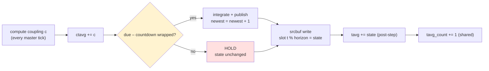
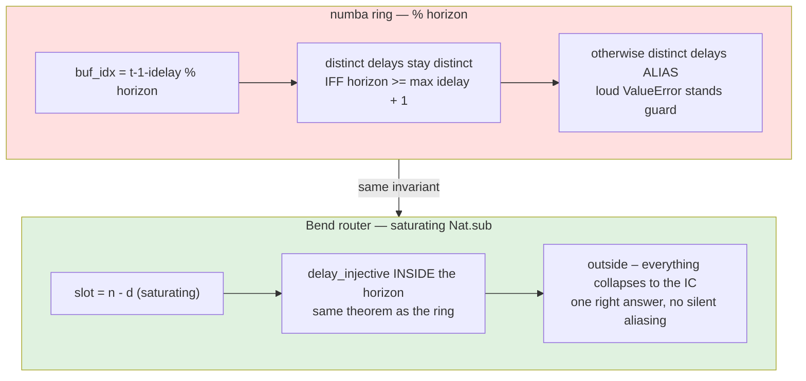
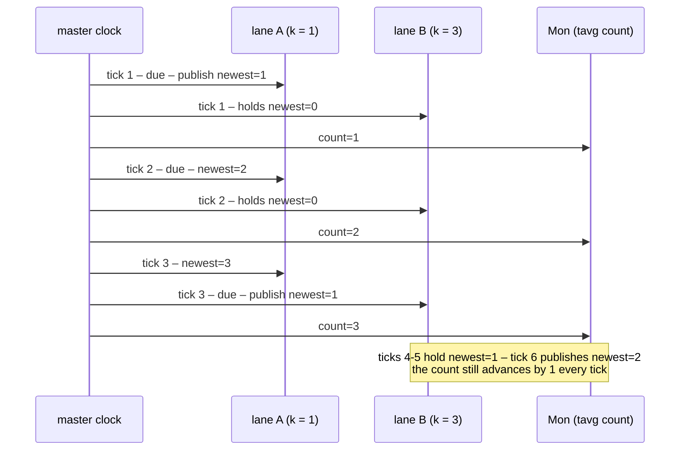
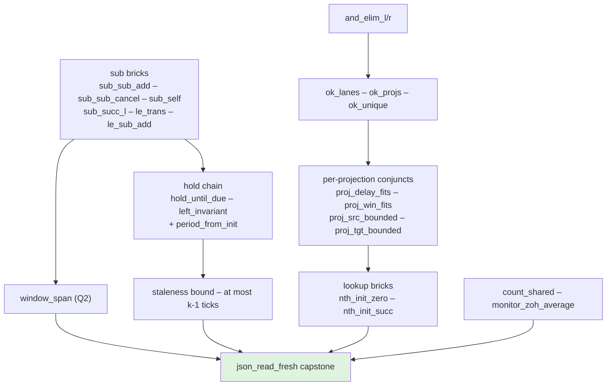

# The Q1/Q2 law family — what the newest Bend laws prove, next to the numba they formalize

> **New here?** Start with [README.md](README.md) — the guided tour (goals, data structures, the high-level laws). This file is a deep dive. Coverage: up to commit `509c627be`; the suite has since grown to 175 laws (ring write path, the three contracts, the coupling wiring) — the README tour is the current map.

*tvb-bend. Companion to the router and JSON-ingress explainers. Covers the six commits after `49f2f5688`: window_span (Q2), hold_until_due / left_invariant (Q1), delay_injective (the horizon rule), the `ok(cfg)=True` law family, and the `json_read_fresh` capstone. Code in `bend_hybrid/` (`router.bend`, `LAWS_router.bend`, `PROOF_router.bend`, `LAWS_json.bend`, `PROOF_json.bend`), engine side in `tvb_library/tvb/simulator/backend/templates/nb-hybrid-sim.py.mako` and `nb_hybrid.py`.*

## What landed, in one table

| law | proves exactly | numba counterpart |
|---|---|---|
| `window_span` (Q2) | the anti-alias window covers exactly `w` samples when `d + w <= n` | the averaging window of a delayed read |
| `hold_until_due` (Q1) | `t < left+1` ticks from countdown `left` hold the newest sample — publishes land on due dates only | ZOH between integrations |
| `left_invariant` (Q1) | the countdown never escapes `[0, k-1]` | the `t % k` schedule |
| `period_from_init` (old) | one publish per period `k` | `if t % k == 0` integrate |
| `delay_injective` | inside the horizon distinct delays read distinct slots | the `% horizon` ring index |
| `count_shared` | ONE tavg counter, +1 per master tick, for ALL subnets | `tavg_count[0] += 1` |
| `monitor_zoh_average` | tavg divides by the MASTER span | `tavg / np.float32(n)` |
| `ok(cfg)=True` family | every validator conjunct is invertible — the "unreachable under ok" comments are now theorems | the `horizon >= max(idelay)+1` ValueError |
| `json_read_fresh` | every routed line of an ACCEPTED config is fresh — for every JSON string, at every tick | (capstone over all of the above) |

Q1 = "how stale can a slow subnet's reads get?" (answer: at most `k-1` master ticks). Q2 = "what does a temporal average average over?" (answer: the ZOH-held trajectory over master time).

## The shared substrate — one master tick

Both sides run the same skeleton per master tick — coupling first, integrate, publish, then bookkeeping:



The Bend side carries the schedule as counters instead of computing `t % k`:

```python
# router.bend — one lane's tick (the due check is a countdown, not div/mod)
def step_go(left: Nat, +l: Lane) -> Lane:
  match left:
    case 0n:
      Lane{lane_k(l), Nat.sub(lane_k(l), 1n), 1n+lane_newest(l)}   # publish
    case 1n+p:
      Lane{lane_k(l), p, lane_newest(l)}                           # hold

# router.bend — the monitor counter, threaded like the lane list
type Mon is Data:
  Mon{n: Nat}

def mon_tick(+m: Mon) -> Mon:
  Mon{1n+mon_n(m)}
```

## Q2 — the read, the window, and the horizon rule

### The numba read is a ring index

```python
# nb-hybrid-sim.py.mako L98 (and L127 for the plain gather) — THE read
buf_idx = (t - 1 - idelays[ptr] + horizon) % horizon
edge_val = srcbuf[cv, src_node, 0, buf_idx]
```

Two distinct delays alias onto one slot whenever the horizon is too small — and the engine says so itself:

```python
# nb_hybrid.py L1558 — the invariant, stated in prose and enforced by crash
# What must still hold is the per-projection modulo-wrap invariant
#     horizon >= max(idelay) + 1
# Violating it would alias two distinct delays onto the same buffer slot and
# silently corrupt the coupling, so we keep a loud failure here.
if p.horizon < max_idelay + 1:
    raise ValueError(...)
```

### The Bend side — saturation instead of wrap, injectivity where it matters

```python
# router.bend — the only place the clamp lives
def route_read(+n: Nat, +d: Nat, +num: Nat, +den: Nat, +win: Nat) -> Line:
  match d:
    case 0n:
      Line{n, n, 0n, den, win}                    # zero-delay clamp
    case 1n+dp:
      Line{Nat.sub(n, 1n+dp), Nat.sub(n, dp), num, den, win}   # Nat.sub SATURATES
```

```python
# LAWS_router.bend — the ValueError's invariant, as a theorem
# "Inside the published history, distinct delays read distinct slots"
law delay_injective:
  for n: Nat
  for a: Nat
  for b: Nat
  for +h: {Nat.is_lt(a, b) == True{} : Bool}
  for hb: R.le_ok(b, n)
  {Nat.is_ne(Nat.sub(n, a), Nat.sub(n, b)) == True{} : Bool}
```

Note where the hypothesis lives: `le_ok(b, n)` — the structural decider, i.e. *b is provably inside the horizon*. That is literally `horizon >= max(idelay)+1` as a proof obligation per edge; `csr_ok` enforces its Bool shadow at job load. Outside the hypothesis the theorem correctly refuses to hold — saturating sub collapses every delay onto the IC slot (that is the JSON-ingress "delay plateau", which turns the same aliasing into safe degradation).



### window_span — the Q2 anti-alias window, quantified

```python
# router.bend — the windowed read (Q2 mode)
def route_window(+n: Nat, +d: Nat, +w: Nat) -> Win:
  Win{Nat.sub(n, Nat.add(d, w)), Nat.sub(n, d)}
```

```python
# LAWS_router.bend — whenever d + w fits the history, the window spans EXACTLY w
law window_span:
  for n: Nat
  for d: Nat
  for w: Nat
  for h: R.le_ok(Nat.add(d, w), n)
  {Nat.sub(R.win_hi(R.route_window(n, d, w)), R.win_lo(R.route_window(n, d, w))) == w : Nat}
```

What makes it tick is a small subtraction library, with the hypothesis as the structural decider so the induction can destructure it (a `Bool` hypothesis cannot be matched while staying live):

```python
law sub_sub_add:
  for n: Nat
  for d: Nat
  for w: Nat
  for h: R.le_ok(Nat.add(d, w), n)
  {Nat.sub(Nat.sub(n, d), w) == Nat.sub(n, Nat.add(d, w)) : Nat}

law sub_sub_cancel:
  for m: Nat
  for w: Nat
  for +h: {Nat.is_le(w, m) == True{} : Bool}
  {Nat.sub(m, Nat.sub(m, w)) == w : Nat}
```

The proof peels `n` and `d` in lockstep — `sub_sub_add_go` above reduces the goal definitionally each step and recurses, the witness `h` riding along unchanged. Five more bricks (`sub_self`, `sub_succ_l`, `sub_zero_r`, `le_trans`, `le_sub_add`) close the span; all are reused by the Q1 half.

## Q1 — staleness, as three commuting facts

```python
# LAWS_router.bend — the hold half (ZOH as a theorem)
law hold_until_due:
  for t: Nat
  for +k: Nat
  for left: Nat
  for +n: Nat
  for +h: {Nat.is_lt(t, Nat.add(left, 1n)) == True{} : Bool}
  {R.lane_newest(R.steps(t, R.Lane{k, left, n})) == n : Nat}

# the countdown half — the schedule never escapes its period
law left_invariant:
  for left: Nat
  for +k: Nat
  for +h: {Nat.is_le(left, Nat.sub(k, 1n)) == True{} : Bool}
  {Nat.is_le(R.left_next(left, k), Nat.sub(k, 1n)) == True{} : Bool}
```

Read together with `period_from_init` (proved earlier — one publish per `k` ticks from the reset countdown): **a `k`-period lane publishes exactly once per `k` master ticks and holds in between, so its newest sample is never more than `k-1` master ticks old.** That is Q1's staleness bound, and the numba side is exactly the held `state` being written into `srcbuf` every tick while `integrate` only fires on due ticks.

The pinned trace (`tests/monitor_smoke.bend`, `k = 1` and `k = 3`) is that staircase:



## The monitors — what tavg divides by

The numba bookkeeping, verbatim:

```python
# nb-hybrid-sim.py.mako L1031 — accumulate the CURRENT (post-step) state
sn_tavg[vi, ni, 0] += _sv
# ...
# L1052 — ONE shared counter, once per master tick
tavg_count[0] += 1
# ...
# L1259 — the emit divides by that same counter
n = tavg_count[0]
sn_outputs.append(sn_tavg / np.float32(n))
```

Two laws pin this. First, the counter is a property of the **master clock**, quantified over the whole lane configuration — a "fixed" per-subnet counter would make the count depend on the periods and the number of lanes and silently rescale every monitor:

```python
# LAWS_router.bend
law count_shared:
  for t: Nat
  for +ks: List<&2, Nat>
  for +m: R.Mon
  {R.mon_n(R.mon_ticks(t, ks, m)) == Nat.add(t, R.mon_n(m)) : Nat}
```

Its proof is one induction step of `Equal.trans` bookkeeping (`1 + (p + n) = (1 + p) + n` via `add_succ`) — the law's `+ks` quantifier is what gives it teeth. The negative control `bad/bad_count.bend` is the per-lane mirror (count += number of lanes per tick) and must fail to typecheck.

Second, the **divisor half** of the tavg story — over one period of a slow lane the count advances by exactly `k`, the master span, not the publication count:

```python
law monitor_zoh_average:
  for +k: Nat
  for +h: {Nat.is_ge(k, 1n) == True{} : Bool}
  for +ks: List<&2, Nat>
  {R.mon_n(R.mon_ticks(k, ks, R.mon_init())) == k : Nat}
```

Conjoined with `period_from_init` + `hold_until_due`, this IS the answer to Q2: a slow subnet's temporal average weights each published sample by its hold length and divides by master time. The strawman it rules out — dividing by the lane's own publication count — gives provably different numbers (`compare_monitor.py` demonstrates the divergence explicitly). The float half of `sum/k` stays with the kernel's op-order laws; this pins the schedule half.

## The `ok(cfg)=True` family — "unreachable under ok" becomes a theorem

`router.bend` used to carry comments like *"`Lane{1n, 0n, 0n}` — unreachable under ok(cfg); the validator bounds src"*. The new family makes each validator conjunct invertible, so those comments are now provable premises:

```python
# LAWS_router.bend — and-elimination, then the validator decomposition
law and_elim_l:
  for a: Bool
  for b: Bool
  for +h: {Bool.and(a, b) == True{} : Bool}
  {a == True{} : Bool}

law ok_lanes:
  for +c: R.Config
  for +h: {R.ok(c) == True{} : Bool}
  {R.lanes_ok(R.cfg_lanes(c)) == True{} : Bool}

# every accepted projection's delay fits the horizon — the csr_ok premise
law proj_delay_fits:
  for +nlanes: Nat
  for +horizon: Nat
  for +p: R.Proj
  for +h: {R.proj_shape_ok(nlanes, horizon, p) == True{} : Bool}
  {Nat.is_le(Nat.add(R.proj_d(p), 1n), horizon) == True{} : Bool}

# src is in bounds — and the lookup lands on a REAL lane
law proj_src_bounded:
  ...  {Nat.is_lt(R.proj_src(p), nlanes) == True{} : Bool}

law nth_init_zero:
  for +k: Nat
  for +ks: List<&2, Nat>
  {R.nth_lane(R.init_lanes(k <> ks), 0n) == R.lane_init(k) : R.Lane}
```

The chain is deliberately decomposed at every conjunct (`ok_lanes`/`ok_projs`/`ok_unique`, `projs_ok_cons`/`projs_ok_tail`, `lanes_ok_cons`/`lanes_ok_tail`, `proj_{delay,win}_fits`, `proj_{src,tgt}_bounded`, `nth_init_{zero,succ}`) so any future `ok`-conditioned routing theorem can pick up exactly the premise it needs. This is the Bend analogue of `nb_hybrid.py`'s `_validate_multi_dt` crash-loudly policy — except here the assumptions travel as proof terms instead of surviving as comments.

## The capstone — `json_read_fresh`

Everything above composed through the JSON ingress:

```python
# LAWS_json.bend — for EVERY string, at every tick, under the validator
law json_read_fresh:
  for +s: String
  for +m: Nat
  for +h: {R.ok(J.json_decode(s)) == True{} : Bool}
  {J.bumps_fresh(J.lanes_run(m, R.init_lanes(R.cfg_lanes(J.json_decode(s)))),
                 R.cfg_projs(J.json_decode(s)), 0n) == True{} : Bool}
```

"For every JSON document the binary accepts, no routed read ever sees the future." The proof is a fold that pairs a leaf with the induction hypothesis at every projection — and the leaf is *the delay-plateau read* whose freshness is one `sub_le` (`n - anything <= n`):

```python
def bump_fresh(+ls: List<&2, R.Lane>, +p: R.Proj, +e: Nat)
    -> {J.line_fresh(ls, J.route_bump(ls, p, e), R.proj_src(p)) == True{} : Bool}:
  sub_le_here(R.lane_newest(R.nth_lane(ls, R.proj_src(p))),
              Nat.add(R.lane_newest(R.nth_lane(ls, R.proj_src(p))), e))
```

So the runtime checks the demo prints ("fresh (i1<=newest)") are not testing — they are the theorem walking.



## How the proofs work — four patterns worth stealing

1. **Order as a structural decider.** `le_ok(a, b)` is `Unit` or `Empty`, so `for h: R.le_ok(Nat.add(d, w), n)` is a hypothesis the induction can destructure (it reduces definitionally as the arguments shrink). The Bool shadow is bridged by `le_ok_iff` / `le_ok_of_b`.
2. **Absurd hypotheses refute anything.** `lt_zero_absurd(p, A, h)` turns `is_lt(p, 0n) == True` into `False == True` and eliminates into any goal via `Bool.fne` — the pattern that closes every dead case (`left=0` with `k=0`, etc.).
3. **`Equal.trans` chains for arithmetic reshuffles** — see `count_shared`'s step (`1+(p+n)` vs `(1+p)+n` through `add_succ`).
4. **Inline the bricks across modules.** A filled `Laws.*` does not re-export through imports, so `PROOF_json.bend` restates `sub_le`/`le_succ_of_le`/`and_intro` locally ("filled laws do not re-export through module imports").

## Verification, in three tiers

- **Laws**: `bend PROOF_router.bend --verdict` and `bend PROOF_json.bend --verdict` — kernel-checked. Negative controls (`bad/bad_count.bend`, `bad/bad_wrap.bend`, `bad/bad_json_time.bend`, …) must all fail (`tests/run_router.sh`).
- **Pinned functional**: `tests/monitor_smoke.bend` freezes the `k=1`/`k=3` staircase and the shared count (output above).
- **Engine-side differential**: `compare_window_hold.py` re-checks `window_span`, `hold_until_due`, `left_invariant`, `delay_injective` exhaustively on an independent Python transcription (with negative controls — the hypothesis of each law is shown load-bearing). `compare_monitor.py` transcribes **the mako template's** tavg semantics and diffs it against the actual Bend router (it generates and runs a `monitor_job.bend`), plus demonstrates that the per-own-step strawman diverges. Floats stay in the differential tier by design — no `F32` value laws exist.

## Reproduce

```bash
cd tvb_library/tvb/simulator/backend/bend_hybrid
tests/run_router.sh                 # verdict + negatives + pinned tests
python3 compare_window_hold.py      # engine-side mirror (any python3)
python3 compare_monitor.py          # template-vs-router differential
```

*Mermaid renders in the HedgeDoc editor preview; the served page may differ — the durable copy is `Q1Q2_LAWS_EXPLAINER.md` in the repo.*
