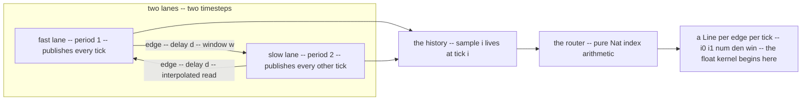
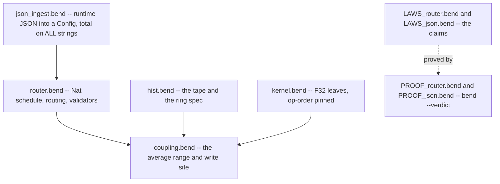
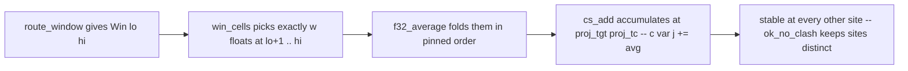

# The Bend hybrid law suite — a guided tour

The Virtual Brain (TVB) simulates whole-brain activity as a network of
**neural mass models**: each brain region runs a mean-field system —
here the Montbrio–Pazo–Roxin rate equations for firing rate `r` and
mean voltage `V` — and regions exchange input over the structural
connectome, whose per-edge weights and axonal delays come from diffusion
tractography. The **hybrid** engine generalises this to multi-scale
co-simulation: the network is cut into subnets that integrate at
*different timesteps* — fast populations at a fine `dt`, slow ones at a
coarse `dt` — and a master clock ticks them in lockstep while every
coupling edge presents its source's *delayed* signal. A fast consumer
reads an interpolated slice of the slow lane's publication stream; a
slow consumer reads a windowed average of the fast lane (the anti-alias
compensation for sampling it sparsely); temporal-average monitors
accumulate the zero-order-held trajectory. What this buys is
expressiveness: one simulation can mix timescales — fast sensory
populations driving slow cortical dynamics — with realistic long-range
delays, without paying the fine `dt` everywhere.

Why prove it: almost all of that machinery is *index arithmetic* — which
sample does edge `e` read at tick `t`, with which interpolation
fraction, over which window, written into which slot — and index
arithmetic fails silently. A one-off in the delay indexing shifts
effective causality; a ring buffer smaller than the horizon aliases old
samples onto fresh reads; a zero-delay read asks for a sample one tick
*in the future*; two edges accumulating into one float slot make the
result order-dependent. None of these crash; all of them change the
science. With several `dt`s the scheduling state space explodes and
review by eye stops scaling. This suite moves the multi-rate semantics
from "trust the template" to theorems: staleness is *provably* bounded
(`stale_bound`), slow inputs are *provably* windowed over exactly the
right samples (`window_span`, `win_cells_nth`), no read ever sees the
future (`read_fresh_ticks`), and writes are *provably* collision-free
(`ok_no_clash`). Any engine implementing the schedule — the numba
template today, a Bend-native or other backend tomorrow — can then be
checked against the same contract instead of re-audited by hand.

How the tvb hybrid simulator's **routing core** was re-cast as a proved
object in [Bend](https://github.com/bendlang/bend) 2.0 — what the data
structures are, what the laws say, and how to check them.

> **What "proved" means here.** The suite proves the *routing* contract:
> which samples a read touches, in what order, how stale they may be, and
> where each computed value is written. Float *values* are deliberately
> out of scope — operator order is pinned instead (rounding order is
> observable in IEEE-754, so order *is* the numerical contract), and the
> numba template remains the value reference. See
> [VALUE_LEVEL_EXPLAINER.md](VALUE_LEVEL_EXPLAINER.md) for what could be
> proved about values, at what cost.

Status: **175 laws** in `LAWS_router.bend`, **28** in `LAWS_sweep.bend`
(the parameter sweep — general width and multi-parameter rows), **5** in
`LAWS_json.bend`, **13** model-level in `LAWS.bend`, every one kernel-verified
(`bend PROOF_router.bend --verdict`), with 17 negative controls that the
checker must *reject*. Everything is quantified: the JSON ingress decodes
**any** string (garbage included), so a claim over `String` is a claim
over every document the binary will ever see at runtime.

The contract itself: three named capstones (section 8 of
`LAWS_router.bend`), plus `sweep_contract` for the parameter sweep
(§2.10):

- **`routing_contract`** — in an accepted config, every routed line at
  every tick is fresh, inside the history window, and well-ordered.
- **`memory_contract`** — every law-bearing read through the engine's
  ring delivers exactly the tape's sample (the ring is a proved
  compression of the tape).
- **`ingress_contract`** — for every JSON string that passes the
  validator, every routed read at every tick is fresh: runtime input
  cannot escape the routing contract.

---

## The router, in plain terms

**One master clock, many timesteps.** The engine ticks a single master
clock. Each subnet is a **lane** — three natural numbers: a period `k`
(publish one new sample every `k` master ticks), a countdown to the next
publication, and a counter of samples published so far
(`Lane{k, left, newest}`). A fast lane (`k = 1`) publishes every tick; a
slow lane (`k = 3`) publishes every third tick and *holds* its newest
sample in between (zero-order hold). The countdown discipline in action,
for a lane with `k = 3` just after a publication:

| master tick | countdown before the tick | publishes? | samples published after |
|---|---|---|---|
| 0 | 2 | no | 1 |
| 1 | 1 | no | 1 |
| 2 | 0 | **yes** | 2 |
| 3 | 2 | no | 2 |

Between publications the held sample is exactly what every consumer sees
— so "how stale can a slow lane's input be" and "what does a monitor
average" are *schedule* questions, answered by the Q1 laws below.

**Coupling is projections.** A projection (`Proj{src, tgt, d, win, tc}`)
says: target lane `tgt` reads source lane `src`, `d` of the source's own
publications back (a slow source's `d = 2` is `2k` master ticks), averaging
the `win` samples ending at that point — the anti-alias window for a slow
consumer of a fast signal — and writes the result into the target's
coupling slot `tc` (the engine's `c[var][j] +=`).

**What the router hands the kernel.** For each projection at each tick,
the routing decision is one `Line{i0, i1, num, den, win}`: the two
*adjacent* source samples to interpolate between, the interpolation
fraction (where the tick falls inside the source's period), and the window
size. Every field is a natural number — the router is pure index
arithmetic, which is exactly why it is provable; the floats begin past the
Line, in the kernel.

**The history has two faces.** The *tape*: sample `i` lives at index `i`
(the semantics, and the subject of every law). The *ring*: the engine's
slot-addressed buffer (the implementation — the correspondence is proved).
The **horizon** bounds how deep a read may reach, and the validator
rejects any config whose reads would reach past it — that is what keeps
the ring from aliasing two delays onto one slot.



## 1. The data structures

| Type | Where | What it is |
|---|---|---|
| `Lane{k, left, newest}` | `router.bend` | one subnet's **schedule**: a carried countdown. `k` = period in master ticks, `left` = ticks to the next publication, `newest` = index of the newest published sample |
| `Line{i0, i1, num, den, win}` | `router.bend` | one **routed read**: interpolation endpoints `i0 ≤ i1`, fraction `num/den`, averaging window `win` |
| `Win{lo, hi}` | `router.bend` | the Q2 anti-alias **window** of a read: `route_window(n, d, w) = Win{n−(d+w), n−d}` |
| `Proj{src, tgt, d, win, tc}` | `router.bend` | one coupling **edge**: read lane `src` at delay `d`, average `win` samples, write the result to node `tgt`, cvar slot `tc` |
| `Config{lanes, projs, horizon}` | `router.bend` | the network: lane periods, projection list, history horizon |
| `Csr{indptr, indices, delays}` | `router.bend` | the per-edge connectome (rows per target node) |
| the **tape** | `hist.bend` | `List<&2, F32>` where element *i* **is** the sample at absolute tick *i*; reads past the end answer the IC fill — the semantic object of the history |
| the **ring** | `hist.bend` / `coupling.bend` | the engine's slot-addressed compression: slot *s* holds the newest tick ≡ *s* (mod cap) |
| `Write{w_tgt, w_tc, w_val}` | `coupling.bend` | one coupling write: the averaged value with its destination site |
| `cs` | `coupling.bend` | the coupling state `c[node][cvar]`, a row-per-node list of F32 slots the `+=` accumulates into |



Everything through `Line`/`Win` is **Nat**: the router is a pure
index-level object and that is what makes it provable in Bend's
term-equality world. The kernel (`kernel.bend`) is the only place F32
appears, and only as opaque terms with pinned operator order.

## How to read the laws

**A law is a claim about all inputs, machine-checked — not a test.** Take
the master law of the read (§2.2):

    law read_fresh:
      for n: Nat
      for d: Nat
      for num: Nat
      for den: Nat
      for win: Nat
      {Nat.is_le(R.l_i1(R.route_read(n, d, num, den, win)), n) == True{} : Bool}

In plain words: *for every history length `n`, every delay `d`, every
interpolation fraction and window, the freshest endpoint the read produces
is at or behind the newest published sample.* The checker
(`bend PROOF_router.bend`, re-checked by the Lean-proved kernel with
`--verdict`) certifies this for **all** values of the quantified arguments
— there are no test cases, because there is nothing left to test.

**Anatomy.** The `for ...` lines are the quantifiers ("for every"). Side
conditions appear as extra arguments: `for h: R.le_ok(d + w, n)` reads
*provided d + w ≤ n* — the condition is carried as a small proof object
rather than a Bool for a technical reason (the checker needs to unfold it
during inductions); you can always read it as an ordinary inequality. The
claim in braces is the conclusion.

**The ladder — why 175 laws.** Roughly a quarter of the file is arithmetic
*bricks* (`add_succ`, `sub_add_cancel`, the divmod family): small facts
the capstone proofs name. When a proof needed a fact that did not exist
yet, that fact became a new law — the file's section headers mark the
families, and the ~25 laws this tour names are the ones a reviewer should
focus on; the rest is the machinery that makes them true.

**Falsifiability.** `bad/` holds 17 claims that must *fail* — a wrong
window count, a regrouped blend, a colliding write, a delay past the
horizon. The gates re-run them and require rejection. A suite that cannot
fail proves nothing.

**Instances pin the intended reading.** Where a convention could be read
two ways (does the window include its endpoints?), a literal law answers
with numbers (`win_cells_instance`: `lo = 1, w = 2` picks ticks 2 and 3).

**Floats are out of scope by design.** The laws pin *operator order* —
which additions and multiplications happen in which order — because in
IEEE-754 that order *is* the observable behaviour. What the values
numerically are is the numba template's contract, tested by the parity
drivers; [VALUE_LEVEL_EXPLAINER.md](VALUE_LEVEL_EXPLAINER.md) lays out
what could be proved about values, and at what cost.

## 2. Walking the high-level laws

The suite is a ladder: arithmetic and structural **bricks** at the
bottom, and a handful of **capstones** at the top that a reader should
actually care about. Here are the load-bearing ones, in the order the
ladder climbs.

### 2.1 The schedule — *how stale can a slow subnet's input be?* (Q1)

- **`period_from_init`** — a period-`k` lane publishes **exactly once
  per k master ticks**, from any IC offset. The publish rate, without
  div/mod.
- **`newest_at`** — at tick `t = q·k + r` the newest published sample is
  exactly `n + q`: the publish count is *exact*, not just bounded.
- **`stale_bound`** — the age of a lane's newest sample is the remainder
  `r ≤ k−1`: a slow subnet's input is **never more than one period minus
  one tick stale**. This is the Q1 answer, as a theorem.
- **`hold_until_due`** — the zero-order hold: ticks before the due date
  hold the newest sample; publications land exactly on due dates.
- **`count_shared` / `monitor_zoh_average`** — the tavg monitors use ONE
  master-tick counter and divide by the master span: a slow subnet's
  average is the master-time average of its ZOH-held trajectory, not a
  per-own-step one.

Composed at the top level by **`tick_split`** / **`run_segmentable`**:
`a+b` ticks = `a` then `b`, so the sweep loop may checkpoint anywhere.

### 2.2 The read — *no read sees the future* 

- **`read_fresh`** / **`read_fresh_ticks`** — every routed line's
  freshest endpoint is at or behind the source lane's newest published
  sample — at every tick, end-to-end (`ok(cfg)` not even needed).
- **`clamp_necessary`** — the zero-delay clamp is *forced*: the
  unguarded read asks for sample `n+1`, one past everything published.
  The clamp is causality, not defensiveness.
- **`degenerate_read`** / **`macro_degenerate`** — the golden rule of
  the multi-rate work, as lemmas: at `k = 1` the multi-dt read **is** the
  single-dt formula `i0 = t − d`, for both routing policies. The two
  policies cannot drift apart on an all-`k=1` network.
- **`line_ordered`** — `i0 ≤ i1` in every routed line: the kernel's
  interpolation interval is never inverted.

### 2.3 The window — *the anti-alias average* (Q2)

`route_window(n, d, w) = Win{n−(d+w), n−d}`; the `w` samples are the
ticks **(lo, hi]** — `lo+1 .. hi` inclusive (pinned by
`win_cells_instance`).

- **`window_span`** — the window covers **exactly `w` samples**
  (`hi − lo = w`) whenever it fits the history.
- **`window_ordered`** / **`window_head_age`** — the ends are ordered,
  and the window's oldest member sits `d + w − 1` ticks behind the head of
  the stream (its left endpoint, `d + w`): the lag is the price of the
  window, and it is forced (making the input fresher means either reading
  past the window's start or shrinking it).

### 2.4 No aliasing, no double writes

- **`delay_injective` → `read_distinct` → `route_distinct`** — two
  distinct in-horizon delays read **distinct** source samples, through
  `route_read`, per projection pair. Outside the horizon everything
  collapses onto the IC (that is the *delay plateau*, §2.7) — so
  aliasing cannot happen silently.
- **`ok_no_clash`** — in an accepted config, two projections writing the
  same target carry **distinct coupling slots**: the order-dependent
  observable (a float `+=`) has no ambiguity to resolve.
- The **`ok(cfg)=True` family** — the validator's conjuncts are
  invertible (`ok_lanes`, `ok_projs`, `ok_unique`, per-index forms):
  everything downstream is proved *conditional on acceptance*, which is
  what the binary actually enforces.

### 2.5 Memory — the tape, the ring, and the correspondence

The history has a two-level story ([HISTORY_DESIGN.md](HISTORY_DESIGN.md)):

- **the tape is the spec** — `hist_read_snoc` (read-after-write),
  `hist_snoc_stable` (appends never change older entries),
  `hist_read_ic` (past-the-end is the IC fill), `hist_prune_shift`
  (pruning reindexes survivors exactly). Anything satisfying these IS
  the tape for the law layer.
- **the ring is a proved compression** — `ring_first_lap` (below the
  capacity the slot address IS the index), then
  **`ring_correspondence`** / **`memory_contract`**: every law-bearing
  read (inside `[n−horizon, n]`, and `horizon ≤ cap` by `ok_cap`) hits
  the slot holding exactly the tape's sample. The write path
  (`ring_write_read`, `ring_snoc_stable`) consumes the divmod family
  (`mod_bound`, `mod_period`, `mod_inj_lap`): a write at tick `i+t`,
  `1 ≤ t < cap`, cannot clobber tick `i`'s slot — the no-clobber fact an
  under-capacity ring violates.

### 2.6 The three contracts

- **`routing_contract`** (§2.1–2.2 composed) — `ok(c)` ⇒ every line of
  every tick is fresh ∧ in-window ∧ ordered.
- **`memory_contract`** (§2.5 composed) — `ok(c)` ∧ `ok_cap(c, cap)` ⇒
  the ring delivers the tape's leaf at every routed endpoint. *Honest
  note:* the statement carries a tie hypothesis
  (`hist_len(tape) = 1 + newest(source lane)`) — the tape must be the
  history the lanes actually published, or the claim is false (a stale
  tick has been overwritten one lap later). The capstone keeps the
  conclusion and adds exactly this premise.
- **`ingress_contract`** — restates `json_read_fresh` (§2.7) as the
  third named member.

### 2.7 Runtime JSON — *what survives the wire*

The decoder is **total**: `json_decode : String → Config`, garbage maps
to the default. So the laws quantify over all strings and hold for every
runtime input by construction.

- **`read_saturate` / `json_delay_plateau`** — asking for a delay past
  the whole history returns the IC read, and **all** absurd delays
  return the *same* line. The router saturates; it never wraps — the
  precise difference from the engines' ring buffers.
- **`json_read_fresh`** — for every string whose decoded config passes
  `ok`, every routed read at every tick is fresh. Accepted input cannot
  escape the routing contract.

### 2.8 The average's routing — *range → average → site*

The user-priority wiring (section 9, `coupling.bend`), closing the
`mcore.bend` pipeline at the spec level:



- **`win_cells_len` / `win_cells_nth`** — the float range fed to the
  average has **exactly the window's length** and **exactly the window's
  indices** (entry `i` is tape tick `lo+1+i`).
- **`edge_cells_len` / `edge_cells_nth` / `edge_cells_span`** — the same
  through the router: the range is positioned at the routed window of
  the *source lane's* tape, and its length equals `win_hi − win_lo`.
- **`w_tgt_site` / `w_tc_site` / `couple_enter`** — the averaged value
  **enters the correct cvar (`proj_tc`) of the correct node/lane
  (`proj_tgt`)** — and `cs_set_stable_row/col` say no other site is
  touched. With `ok_no_clash`, one write per tick per site.

### 2.9 The leaves — operator order is the contract

`blend_order` (decision 1's pinned interpolation, term for term),
`cfun_linear_order`, `gather_nil`/`gather_cons` (edges fold in config
order), `f32_sum_cons`/`f32_average_def`. These are *definitional* laws:
a future re-association — even a value-equal one — breaks them. In
IEEE-754 that is exactly the numerical-fidelity contract wearing a
structural costume.

### 2.10 The sweep — *which sim gets which parameters*

A sweep runs a batch of sims from one job: `n_sweep` sims, each with its
own parameter row (today one varying float per sim; the design target is
arbitrary per-sim parameter sets from JSON — the schema is the one open
question). The engine fans the batch over a **fixed 8 parallel lanes**:
lane `k` runs sim `k`; lanes past `n_sweep` sit idle (their slot costs a
match, not a simulation); per-sim outputs concatenate in lane order.

**What can go wrong.** Sim 3 reads row 2 (index arithmetic off by one);
a sweep wider than the fan silently loses sims (no error — they simply
never run); the gather puts sim 4's output in block 3; a malformed row
reaches a sim unvalidated; the parallel execution order leaks into the
results.

**What the laws enforce** (28 laws, `LAWS_sweep.bend`, gate
`tests/run_sweep.sh`; the family generalizes to any fan width —
`fan_exact` — and to multi-parameter rows — `sweep_row_nth`,
`col_to_row` for the TVB named-key column orientation):

- **Row routing** (`sweep_nth_route`, pinned by the head and stride laws
  plus literal instances): the parameter reaching sim `i` is exactly table
  row `i` — provable only inside the table (the bounds witness cannot be
  fabricated), so an off-by-one makes the proof unwritable.
- **Coverage** (`fan8_exact`): the active lanes are exactly `0..n−1`,
  each running once. Both bounds are load-bearing — the interesting one
  is the width: the fan is *fixed at 8 lanes*, so a sweep of 9 sims cannot
  even state coverage. The validator turns that into a rejection
  (`sweep_ok_width`): an oversized sweep fails at load time instead of
  silently truncating.
- **Gather** (`fan_gather_order`): the fan's output equals the sequential
  concatenation `run(0) ++ ... ++ run(n−1)` — the "embarrassingly
  parallel is correct" claim: parallel execution provably computes what
  running in order would.
- **The capstone** (`sweep_contract`): for a validated sweep, any sim
  `i`, and any projection `j` of the shared config, one claim says all
  of: the parameter reaching sim `i` IS row `i`; sim `i`'s result lands
  in output block `i`; and the per-sim routing contract (fresh,
  in-window, ordered reads from the router suite) holds at projection
  `j`. The three halves are different types, so the law is a triple
  equality — it holds exactly when every half does.

Remaining gap (documented in the law file's header): the JSON ingress
for sweeps (the schema choice — per-sim rows vs per-parameter columns),
and the byte→word decode of the packed sweep table (the decode machinery
is shared with the edge sections and pinned by the packed-roundtrip laws
of `LAWS.bend`).

## 3. How the proofs work

- **Everything is a law.** Bend has no lemma-in-a-proof, so the
  arithmetic bricks (`sub_add_cancel`, `add_succ`, `mod_inj_lap`, …) are
  laws too. The suite is a ladder: capstones are proved by
  *instantiating* bricks, and a missing fact becomes a new small law.
- **Structural deciders.** `le_ok`/`lt_ok` are `Type`-valued (Unit /
  Empty / recursive) so inductions can destructure them; the Bool forms
  stay as bridge laws (`le_ok_iff`).
- **Equal plumbing.** Goals chain through `Equal.cong`/`Equal.sym`/
  `Equal.trans`; `Bool.fne` refutes `False == True` hypotheses that arise
  when a decider computes.
- **Instance laws pin readings.** Where comments disagree (e.g. the
  window's inclusivity), a literal instance (`win_cells_instance`,
  `csr_row_good_0`, `ring_of_good_4`) pins the intended reading.
- **Negative controls.** `bad/` holds 17 malformed claims (double
  writes, over-horizon delays, wrong counts, regrouped blends, …) that
  the checker must *reject*. A suite that cannot fail is not a suite.
- **Toolchain traps** live in [NOTES.md](NOTES.md) — read it before
  editing (no forward refs, `1n+(+p)` for unrestricted pattern binders,
  the decreasing argument must come first, …).

## 4. Running the gates

```bash
export PATH="$HOME/.local/bin:$PATH"     # lean, for --verdict
cd tvb_library/tvb/simulator/backend/bend_hybrid
bash tests/run_router.sh                 # 175 laws + 17 negatives + pinned tests
bash tests/run_json.sh                   # ingress laws + compiled-binary JSON runs
bash tests/run_sweep.sh                  # sweep laws + the width negative + sweep smoke
```

The bend binary is `/home/duke/.bend/bin/bend` (v2.0.34). Both gates end
in `all green`; `--verdict` re-checks the proofs with the Lean-proved
kernel (the checker/kernel trust story: see `ECOSYSTEM.md` — keep
`--verdict`, never introduce `~` template params in proof files).

## 5. Files and further reading

| file | role |
|---|---|
| `router.bend` | the Nat-level router: lanes, lines, windows, validators, CSR |
| `hist.bend` | the tape (spec) and the ring (proved compression) |
| `kernel.bend` | the F32 leaves: blend, cfun, gather, the window average |
| `coupling.bend` | the average's range (`win_cells`/`edge_cells`) and write site (`Write`, `cs`) |
| `json_ingest.bend` | the total JSON decoder (explicit state machine) |
| `LAWS_router.bend` / `PROOF_router.bend` | the 175 claims and their proofs |
| `LAWS_sweep.bend` / `PROOF_sweep.bend` | the 15 sweep claims and their proofs |
| `sweep.bend` | the sweep spec: the parameter table, the fan, the gather |
| `LAWS_json.bend` / `PROOF_json.bend` | the ingress claims and proofs |
| `bad/` | negative controls — must be rejected |
| `tests/` | the gates |

Deep dives, roughly in reading order:

1. [ROUTER_EXPLAINER.md](ROUTER_EXPLAINER.md) — the big picture: a brain
   simulator without proving floats; policies as schedules.
2. [Q1Q2_LAWS_EXPLAINER.md](Q1Q2_LAWS_EXPLAINER.md) — the Q1/Q2 law
   families interleaved with the numba engine they formalize.
3. [HISTORY_DESIGN.md](HISTORY_DESIGN.md) — the tape/ring decision
   record.
4. [JSON_INGEST_EXPLAINER.md](JSON_INGEST_EXPLAINER.md) — runtime
   configs and the delay plateau.
5. [VALUE_LEVEL_EXPLAINER.md](VALUE_LEVEL_EXPLAINER.md) — what Bend can
   and cannot do about float *values* (the tiered answer).
6. [ECOSYSTEM.md](ECOSYSTEM.md) — Bend tooling recon and the hardening
   results (bendcheck fuzz, verdict trust).
7. [NOTES.md](NOTES.md) — operational gotchas and proof-system facts.
8. [BEND_TVB_GUIDE.md](BEND_TVB_GUIDE.md) — writing Bend for TVB work.
9. [SWEEP_LAWS_DESIGN.md](SWEEP_LAWS_DESIGN.md) — the sweep-routing proof
   plan (implemented; the JSON ingress question remains open).

Python mirrors: `compare_window_hold.py` (the window/hold laws checked
against an independent Python transcription), `compare_monitor.py`.

---

## Part II — the engine prototype (preserved from the original README)

*The `mcore.bend`/`mengine.bend`/`montbrio_sweep.bend` prototype this law suite grew around — measured results, idioms, recorded bugs, and limits. Preserved from the original README (headings demoted one level; the file table's entry points updated to the converged docs).*

### Bend MontbrioPazoRoxin hybrid prototype

A minimal, idiomatic Bend port of the numba hybrid kernel
(`tvb/simulator/backend/nb_hybrid.py`) for one subnet, one mode, MontbrioPazoRoxin,
Heun, a CSR connectome with per-edge integer-step delays, and a parameter sweep
over the projection coupling scale.

It ships as a **standalone binary**, not a Python extension — see *Runtime shape*
below for why Bend 2.0 cannot be one.

| file | role |
|---|---|
| `mcore.bend` | the model: decoding, the Montbrio drift, the clamp, one Heun step |
| `mengine.bend` | the simulation: coupling pass with delays, state update, history push, the step loop |
| `montbrio_sweep.bend` | the CLI: job loading, the data-parallel sweep, output |
| `LAWS.bend` / `PROOF.bend` | the specification and its proofs (`bend PROOF.bend --verdict`) |
| `run_montbrio.py` | writes the job files, runs the binary, parses the output |
| `compare_montbrio.py` | compares against numba and `NbHybridBackend`; parity, isolation |
| `bench_montbrio.py` | the benchmark |
| `BEND_TVB_GUIDE.md` | **start here for new work**: which parts of a TVB hybrid sim suit Bend, and why |
| `NOTES.md` | syntax and toolchain traps; measured runtime facts |
| `README.md` | this file — design, results, and limits |

```bash
BEND=/home/duke/.bend/bin/bend
$BEND montbrio_sweep.bend -o montbrio_sweep        # build (~3 s)

python run_montbrio.py    --n 300 --steps 300 --points 8 --threads 8
python compare_montbrio.py --n 300 --steps 300 --points 8 --threads 8
python bench_montbrio.py  --n 300 --steps 300 --points 8 --threads 8
$BEND PROOF.bend --verdict                          # ALL PROOFS CHECK
```

---

### 1. Measured results

Machine: 8 cores, no CUDA. `tvb_library/.venv` (numba 0.68, numpy 2.5).
Workload: `N=300` nodes, dense off-diagonal connectome (89 700 directed edges),
per-edge delays `0..10` steps, ring of 16 slots, 300 steps, 8 sweep points over
`coupling_scale ∈ [0, 5]`.

#### Numerics

| check | result |
|---|---|
| one-step drift, bit-exact vs a float32 numba kernel | **exact** (`r` and `V`), with and without delays |
| traces vs `NbHybridBackend`, delays 0..10, **coupled** (scale 2.0) | max rel dev `r` **9.2e-06**, `V` **5.6e-07** (tol 1e-4) |
| traces vs `NbHybridBackend`, delays 0..10, uncoupled (scale 0) | max rel dev `r` **0.0**, `V` **5.1e-07** |
| traces vs `NbHybridBackend`, zero delays, coupled | max rel dev `r` **0.0**, `V` **5.6e-07** |
| identical steps (per-step integers) | coupled+delays: `r` 299/300, `V` 292/300 — uncoupled: `r` 300/300 |
| delays zeroed in Bend only (must fail) | **fails**: 1.2e-02 (`r`), 1.4e-02 (`V`), identical steps 218/300 |
| each sweep point alone vs in-sweep | **exact**, deviation 0 |
| repeated runs | byte-identical |

Note the coupling matters to the headline: an uncoupled run (`scale = 0`) has
`r` bitwise equal to `nb_hybrid` for all 300 steps, but it does not exercise the
delayed gather at all, so the **coupled** row is the one that means anything.
`r` is otherwise within 1e-5 and `V` within 6e-07 of the reference; both gaps
are the float64-intermediate term of §3.

#### Speed

| | 8-point sweep | per point |
|---|---|---|
| **Bend** (1 process, 8 threads) | **553.8 ms** | 69.2 ms |
| numba (8 points, sequential) | 2821.2 ms | 352.6 ms |
| Bend, single point, 1 thread | — | 331.2 ms |
| numba, single point | — | 344.7 ms |

Sweep: **5.09× faster** than the numba baseline. Per point on one core Bend is
**0.96×** numba — the kernel is marginally slower, and the sweep win comes
entirely from the 8-way fan-out (331 → 69 ms per point, 4.8× on 8 cores).
min of 5 reps after 2 warmups; medians 576 ms / 2830 ms.

The numba baseline is the one in `bench_cpp_vs_numba.py`: eight points driven
one at a time. Both sides pay per-point array/buffer setup.

---

### 2. Bend 2.0 idioms the design depends on

Every item here was established by running the compiler; the ones that cost the
most time are the ones that differ from what you would write in any other
language.

**Numeric types.** `F32` is IEEE-754 single precision, bit-identical to C++
`float` — verified in `base.bend` (`type F32 is Data: F32{data: Word(32n)}`).
There is no `f24` (that was the old HigherOrderCO Bend) and **no `F64`** at
all. `F32.to_u32` is a numeric truncation, not a bit cast, so Bend can neither
read nor write a float32 buffer. That single fact dictates the whole data plane.

**No `if`.** A condition is a `match` on `True{}` / `False{}`, or
`Bool.pick(T, c, a, b)` — which consumes *both* branches, so a value used in
either is consumed twice.

**No field access.** `x.f` does not exist. Every field read is its own accessor
def that matches on the parameter. For `struct proj`-shaped data this is a real
per-field tax, and it is the reason a Bend port wants generated per-model code
rather than hand-written kernels.

**Affine by default.** A `let` or parameter may be used at most once; `+` marks a
binder reusable, which requires its type to be `Data`. An `Array` is a `Type`
(single owner) and can never be `+` — it must be threaded. A record holding
arrays is therefore `is Type` too.

**Termination checking.** A recursive call needs a *shrinking* argument, read
left to right, and everything after it is free. A counted loop grows its index,
so each loop threads a remaining count first and the absolute index alongside.
A `match` supplies the smaller value directly (`case 1n+p` → recurse on `p`),
which is why the loops look the way they do.

**`match` inspects parameters and pattern bindings only** — never a computed
value, and never a local binder. So a fetched value has to be carried in as a
*parameter* to be destructured, which forces a one-step lag between fetching and
using. This is the single deepest constraint in the port; §4 is about it.

**One `match` per def, several values at once with `match a b:`** in binder
order. A `let` may not precede a `match` on a parameter.

**No mutual recursion.** Two functions that call each other become one def with
an argument selecting which to run. Where mutual recursion seemed unavoidable
(the `emit_both` / `in_sec` pair, the argv parsing), the fix was a flat
multi-cons pattern (`case b0 <> b1 <> b2 <> b3 <> t:`) or `Maybe.default`.

**Arrays** give in-place mutation under purity: `Array.new(T, d, v)` with a
power-of-two size and **wrapping indexes**, `Array.set(T, a, i, v)`,
`Array.get(T, a, i)` returning a dependent pair `Array<T> & T`, `Array.to_list`.
`Array.get` needs the element type spelled out and the type cannot be inferred
from the destination.

**Parallelism is the parallel let** `a b = f(x) g(x)` — there is no
`bend x = e:` block binding. **`IO.spawn` does not fan pure work out**: on this workload (300 nodes, 300
steps, delays) the spawn version measured 1 point 206 ms, 2 points 432 ms, 8
points 1412 ms — exactly serial, `n * t`. That is why the sweep was rewritten
with parallel lets (the spawn code path no longer exists in `montbrio_sweep.bend`). The
whole parallel win in §1 comes from nested parallel lets inside one `do` block.

**Laws.** `{==}` is *structural* reflexivity — both sides must reduce to the
same term. Integer arithmetic normalises; **float values do not**, not even
`F32.add(0.0, 0.0) == 0.0`, nor a `match` on a concrete `Bool`. So Bend 2.0
cannot prove a float value equality at all, and this prototype's laws are
structural identities plus integer identities; every numeric claim is checked
numerically by `compare_montbrio.py` instead.

---

### 3. Where the numbers can diverge from numba, and how they are pinned

The drift is a **literal transcription** of the model's expression strings in
`models/infinite_theta.py`:

```
"r": "1/tau * ( Delta / (pi * tau) + 2 * V * r)"
"V": "1/tau * ( V*V - pi*pi*tau*tau*r*r + eta + J * tau * r + I
                + cr * Coupling_Term_r + cv * Coupling_Term_V )"
```

evaluated strictly left to right, one rounding per operator, because the numba
kernel embeds the same string and therefore performs the same operations in the
same association. An algebraically equivalent regrouping is **not**
bit-identical: `(1/tau) * X` and `X / tau` round differently, and
`((((pi*pi)*tau)*tau)*r)*r` is not the same term as `(pi*tau)*(pi*tau)*(r*r)`.
`LAWS.bend` pins this: mistranscribing `2*V*r` as `2*r*V` makes
`bend PROOF.bend` report `SOME PROOFS FAIL` (IEEE multiplication is commutative,
so the *values* still agree — the law exists to stop a future edit silently
regrouping a sum, which would change rounding).

Remaining, deliberate sources of divergence:

1. **float32 vs float64 intermediates.** `nb_hybrid`'s generated kernel embeds
   `pi = np.pi` and reads model parameters as Python floats, so parts of its
   drift evaluate in **float64** and round once on the way back into the float32
   state. Bend has no `F64` and computes in float32 throughout. This is the
   dominant term in the residual 7e-08, and it is why the traces are not bitwise
   equal even though the one-step drift against a *float32* kernel is.
2. **`cr` / `cv` are parameters, not the coupling.** The coupling term is
   `cr*Coupling_Term_r + cv*Coupling_Term_V` — the model weight times the
   incoming value. Getting this wrong is silent: the run still looks plausible.
   It is the default `cv = 0.0` (coupling enters through the rate variable
   only), and a job with `cv = 1.0` disagrees with the reference by ~20 %.
3. **The fixed-point job encoding.** Bend reads scaled integers and divides by
   1e6 in `F32`. The reference therefore receives the *same* decoded values, not
   the original ones — otherwise the comparison would measure the encoding
   rather than the arithmetic.
4. **`F32.show` is not round-trip exact** (it prints ~7 significant digits), so a
   text float can land an ulp from the value actually computed. The trace
   channel therefore carries `round(value * 1e6)` as an **integer**, which makes
   the comparison exact; this was masking a spurious "1 ulp" difference before
   it was found.

---

### 4. Three bugs worth recording

They are the reason the delay handling works at all, and each was found by a
measurement rather than by reading the code.

**The history read lagged one edge.** `Array.get` returns a dependent pair, and a
`match` may only inspect a parameter — so a fetched value has to be carried into
the *next* call as a pair. That made every iteration consume the previous edge's
address. The fix was a two-step prefetch: carry the packed edge word for edge
`e+1` as well, so the current call can form edge `e+1`'s address and fetch its
value for the next call. Each array is still used exactly once per iteration.
Verification trick: set every initial state and weight to 1.0 and give edge `e`
the weight `100*(e+1)` — then each row's coupling *is* the list of edges it
summed.

**The seed address hard-coded tick 1.** `seed_coup` formed the address of the
first edge's read with `t = 1` written into the expression, so from step 2 on
the *first* row read the wrong history slot while every other row was correct.

**The tick advanced in the wrong pass.** The `t` increment lived in the coupling
pass, but the update pass reads `t` to derive the trace index (`t-1`) and the
push slot (`t`) — so from step 2 on both were off by one.

---

### 5. Runtime shape: why a binary and not a Python extension

Bend 2.0 emits a native binary, C, JS, `.mjs` or BendTT. There is no Python
target and no way to call a Bend def from Python:

* the emitted C is a **whole program** — `int main(argc, argv)` plus everything
  else `static`. A toy def's name appears **zero times** in the emitted C; it is
  inlined into `main`. There are no exported symbols to link against, so a
  hand-written nanobind/pybind11 layer is impossible without patching the
  compiler's emitter;
* the only host-code door is *effects* (`import "./x.c"`), and that is Bend
  calling C, not C calling Bend.

So the CLI is a binary and Python is the client. The data plane is binary files
holding little-endian u32 words (`File.read_bytes` returns one `U32` per byte),
which the job needs anyway because Bend cannot emit float32 bytes. The control
plane is argv (`IO.args` → `U32.read`) plus environment variables for the eight
section paths — a `List<String>` is a single-owner `Type` and cannot be copied
for repeated indexing, while `IO.get_env` hands back a `String`, which is
`Data`. Each section lives in its **own file** so that each decoded `Array` has
exactly one consumer, for the same single-owner reason.

---

### 6. What this prototype does NOT cover

Stated explicitly, because every item is a real difference from
`nb_hybrid`/`cpp_hybrid` and none of them is a rounding detail.

1. **One subnet, one mode.** No inter-projection, no mode maps, no multi-area
   state.
2. **One model.** MontbrioPazoRoxin only, with a hand-transcribed drift. No
   generic `state_variable_dfuns` codegen — the analogue of `dfungen.py` does
   not exist yet, so the other 26 models `nb_hybrid` supports are absent.
3. **Integer-step delays only.** The multi-dt fractional interpolation
   (`tau = (t-1)/K - delay`, `s0/s1`, `alpha`) is not implemented: there is no
   `K`, one `dt` for everything.
4. **Coupling functions.** `Linear` only (`a*x + b`). The other seven classes
   (`scaling`, `sigmoidal`, `sigmoidal_jr`, `sigmoidal_jr_legacy`, `tanh`,
   `difference`, `kuramoto`, `pre_sigmoidal`, `pre_sigmoidal_dynamic`) and their
   `globalT` pre-pass are absent.
5. **Monitors.** No Raw/Subsample/Bold monitor engines. The prototype emits
   node 0's `r` and `V` at every step as a fixed-point trace, which is enough to
   check parity but is not a monitor: no temporal average, no HRF convolution,
   no chunk normalisation, no sensors.
6. **No noise, no stimulus, no surface.** Deterministic Heun only.
7. **Sweep fan-out is fixed at 8 lanes.** `sweep8` always forks 8 branches and
   masks the lanes past `n_sweep`; a 3-point sweep wastes 5 branches, and a
   16-point sweep is wrong. A recursive fan-out would be better; this was a
   deliberate choice to keep the loop shape simple.
8. **Floating-point output only for node 0.** The trace is one node's two
   series. Spatial sums and full-state output are not implemented.
9. **No laws for the numerics.** Bend 2.0 cannot prove a float value equality,
   so the numerical claims live in `compare_montbrio.py`, not in `PROOF.bend`.
   `--verdict` gates the structural and integer laws only.
10. **Performance is CPU only.** No CUDA on this machine, so `!` calls fall back
    to CPU. The GPU path (`--gpu`, the `file.gpu` sidecar) is untested, and the
    fork-join scheduler's GPU behaviour is unknown here.
11. **No integration with the TVB build.** `bend_hybrid/` is inert: it is not
    wired into `tvb_library/CMakeLists.txt`, imports nothing from TVB, and no
    `BendHybridBackend` is registered. `compare_montbrio.py` builds the network
    by hand rather than going through `NetworkSet`.
12. **Stability is not a constraint.** `state_variable_boundaries` is honoured
    for `r` only (`r < 0 → 0`); the upper bound and the `isfinite` guard the
    generated kernel emits are not.
