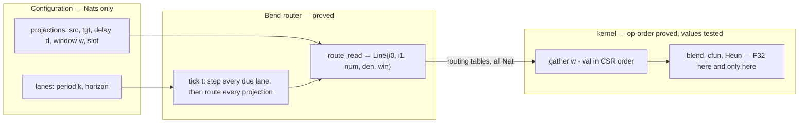
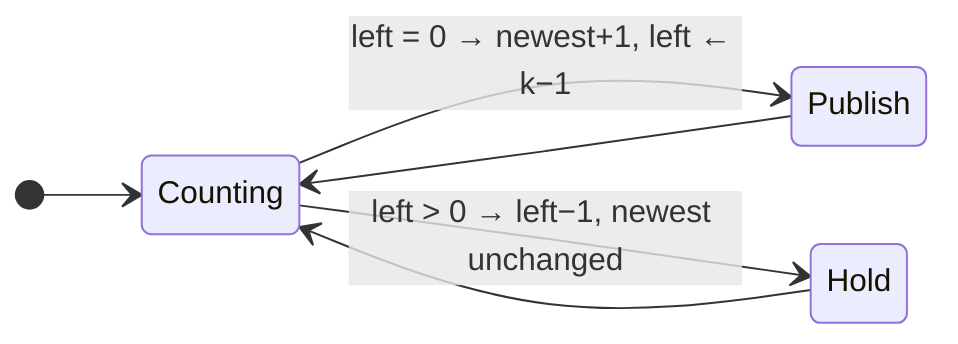
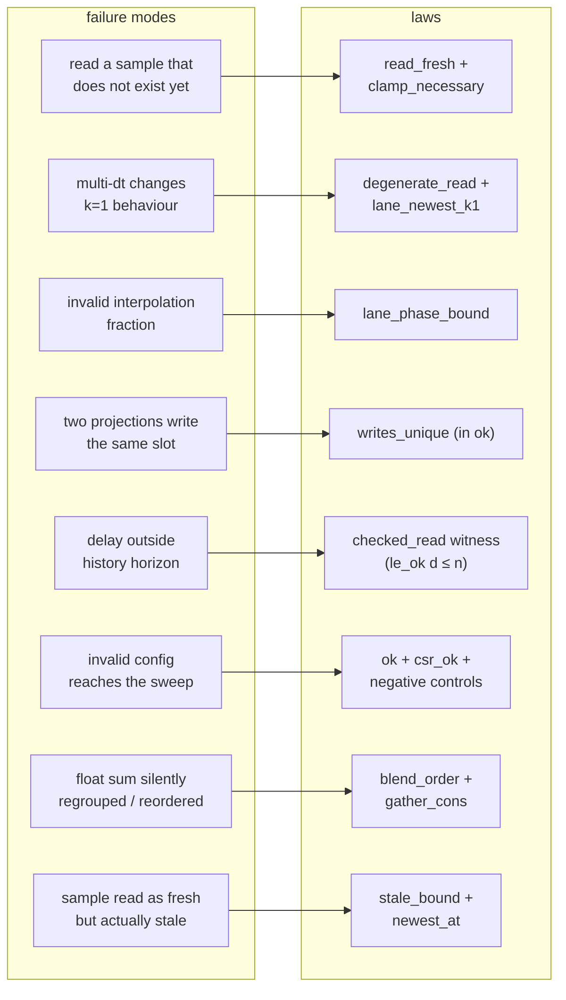
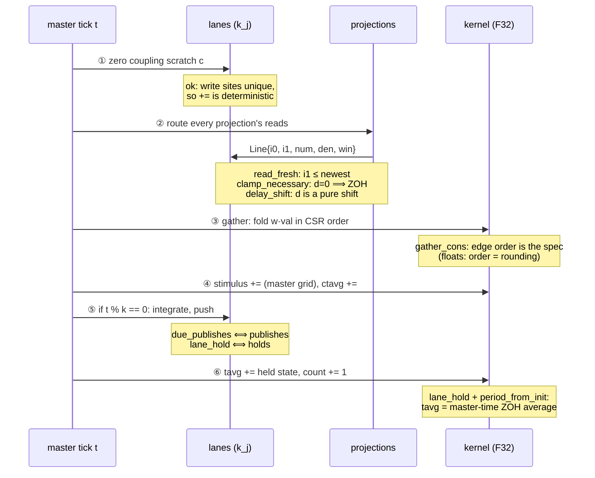
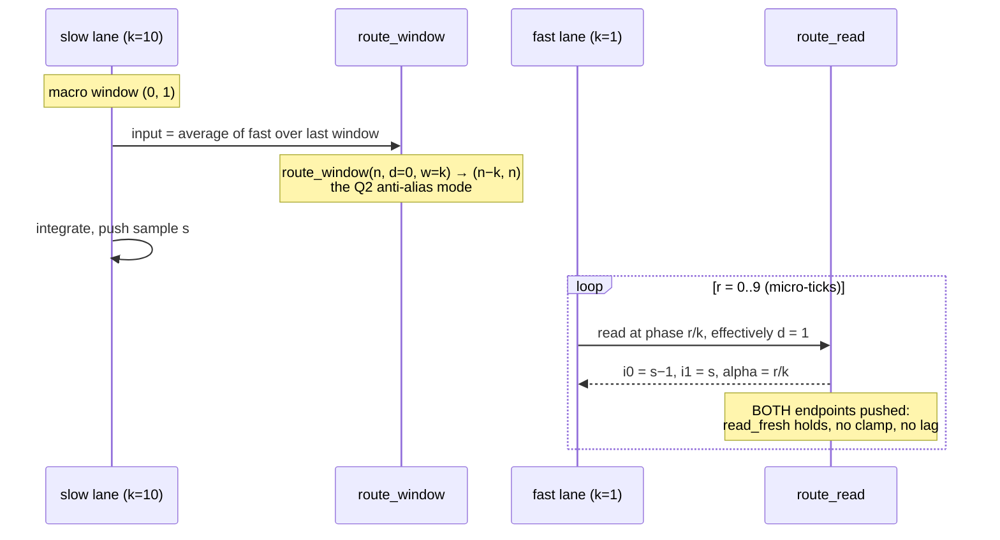
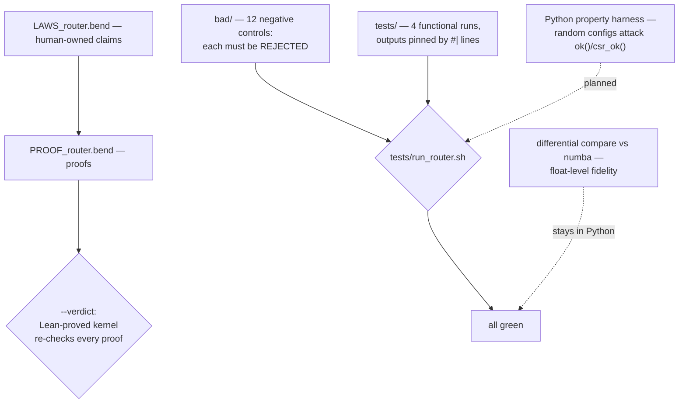

# Proving a brain simulator without proving floats

*v2 — expanded: the full law catalogue, routing policies as schedules, sequence diagrams, and the first verified kernel leaf. How the tvb-kh hybrid simulator was re-cast as a verified router, in Bend 2.0.*

**TL;DR.** A TVB hybrid simulation — heterogeneous subnetworks, inter-/intra-projections, monitors, stimuli, multi-rate timesteps — fails in ways that are *structural*, not numerical: a delay outside the history horizon, two projections writing the same coupling slot, two delays aliasing onto the same ring slot, a zero-delay read off the end of the ring, a regrouped float sum. We rebuilt the *scheduling and routing* of the simulator as a pure program over natural numbers, stated its correctness as **115 machine-checked laws**, and let the floats be payload — until the last layer, where floats return as *operator-order contracts* (which is exactly what IEEE-754 rounding is). The router that decides *what* the kernel reads and writes, *when*, is proved; the kernel that computes is differential-tested; twelve negative controls keep the laws honest.

Everything below is running code: `bend PROOF_router.bend --verdict` re-checks every proof with a small Lean-proved kernel, and the gate (`tests/run_router.sh`) also runs the negative controls and pinned functional tests.

---

## 1. Why: the bugs that actually bite are structural

Three real bugs from this project, all silent:

- **The `cv` trap.** `MontbrioPazoRoxin` defaults its `cv` parameter to `0.0`. A job with `cv=1.0` disagrees with the reference by 20% and still looks plausible. Coupling that is silently absent.
- **The horizon collapse.** Zeroing delays on only one side of a comparison collapses the reference's history ring from 16 slots to 1 — a fake 21% mismatch that looks like a numerics bug.
- **The ZOH off-by-one.** A zero-delay edge asks for sample `newest+1` — one past everything the source has published. The clamp that saves you looks defensive, optional, removable. It is none of those; it is *necessary* (proved, §5).

None of these are float bugs. They are routing bugs: *which sample, at which tick, in which slot, from whom*. The current codebase expresses this routing as mako template string-interpolation — Python ifs choosing codegen branches. Logic that exists only as generated text cannot even *state* an invariant, let alone prove one.

## 2. The reframe: the simulator is a router; floats are the cargo

Strip the floats and a hybrid network is a **tree of naturals**: subnetworks ("lanes") with periods and publication counters, projections as routing edges (source lane, target lane, delay in source samples, averaging window, target slot), monitors and stimuli as leaves on the master clock.



The router decides **when** each lane steps, **which** source samples each projection reads, **with what** interpolation fraction and averaging window, and **where** the result lands. Every one of those decisions is an integer function of the tick. The floats — the actual neural state — are cargo the router never opens… until the leaf layer (§8), where they return as *terms whose order is pinned*.

## 3. The schedule: carried counters, not closed forms

The obvious way to compute "how many samples has a period-k lane published by tick t" is `div(t, k)`. We deliberately don't. The schedule is **carried**: each lane is a counter that counts down to its next step and increments its publication count when it wraps.



- `newest` = index of the newest published sample; sample 0 is the initial condition.
- `left` = master ticks until the next step; the interpolation position is derived: `num/den = (k−1−left)/k` — a fraction **carried as two naturals**, so it stays inside the provable world.

Why carried counters? A closed form needs a `div`/`mod` lemma library before any schedule law can be proved; a counter makes every schedule law a **plain structural induction over the tick stream** — the one thing a checker like Bend does effortlessly. Designing *for the prover* paid the proof debt up front, in the data representation. In Bend (Python-shaped syntax):

```python
type Lane is Data:
  Lane{k: Nat, left: Nat, newest: Nat}

# one master tick for one lane: publish when the countdown wraps
def step_go(left: Nat, +l: Lane) -> Lane:
  match left:
    case 0n:
      Lane{lane_k(l), Nat.sub(lane_k(l), 1n), 1n+lane_newest(l)}
    case 1n+p:
      Lane{lane_k(l), p, lane_newest(l)}

def steps(t: Nat, +l: Lane) -> Lane:      # t master ticks; shrinking arg first
  match t:
    case 0n: l
    case 1n+p: steps(p, step_lane(l))
```

## 4. The routing decision: one function, and the clamp is load-bearing

All the subtlety of multi-rate, delayed, interpolated coupling concentrates into one function — `route_read(n, d, num, den, win)`, with `n` the newest published index and `d` the delay in source samples:

```python
# THE routing decision, and the only place the ZOH clamp lives.
#   d = 0 : the asked-for ceil sample is one past the newest (PROVED),
#           so clamp i1 = i0 and zero the fraction;
#   d >= 1: i0 = n-d, i1 = n-d+1 are both published (PROVED), and the
#           fraction passes through.
def route_read(+n: Nat, +d: Nat, +num: Nat, +den: Nat, +win: Nat) -> Line:
  match d:
    case 0n:
      Line{n, n, 0n, den, win}                       # ZOH clamp
    case 1n+dp:
      Line{Nat.sub(n, 1n+dp), Nat.sub(n, dp), num, den, win}
```

Two properties make this function trustworthy rather than merely plausible:

- **`clamp_necessary`** — the *unguarded* zero-delay read is **always** one past the newest, for every history depth. The clamp is not defensive programming; removing it breaks every zero-delay edge, provably.
- **`read_fresh`** — every routed Line, for any delay, fraction and window, satisfies `i1 ≤ newest`. Freshness is universal *because the clamp is part of the constructor*: there is no code path that produces a stale read.

Below zero, saturating subtraction lands on sample 0 — the initial-condition fill, exactly like the engines' pre-filled rings (nb_hybrid broadcasts the IC across all horizon slots).

## 5. The law catalogue (115, proved)

Laws follow the Bend convention: `LAWS_router.bend` is the human-owned *claims*, `PROOF_router.bend` the discharge; `bend PROOF_router.bend --verdict` re-checks with a Lean-proved kernel. Grouped:

**Arithmetic bricks** (proved once, reused): `sub_zero`, `add_zero`, `add_succ`, `add_one`, `add_sub_succ`, `sub_add_cancel`, `le_refl_b`, `le_succ_b`, `le_succ_of_le`, `sub_le_b`, `lt_succ_b`, `eq_refl_b`, `ne_succ`.

**Schedule**: `lane_newest_k1` (a period-1 lane publishes exactly once per tick), `lane_k_preserved`, `lane_phase_bound` (the interpolation fraction is always proper — this is where k ≥ 1 lives, as a *hypothesis* an invalid config cannot supply), `lane_monotone` (publication never regresses), and — new — the **Q1 staleness capstones**: `canonical_run` (q·k ticks from the countdown init advance `newest` by exactly q — the whole periodic run in one equation, no div/mod), `newest_at` (at t = q·k + r with r ≤ k−1 the newest sample is exactly n+q), `stale_bound` (the age of the newest sample at t is the remainder r ≤ k−1: the "up to k−1 ticks stale" prose as a theorem), plus `window_ordered` / `sub_le_mono` (a window that fits the history has its ends in order; sub is antitone).

**Control flow** — these are the main loop's own comments, promoted:

| law | the prose it replaces |
|---|---|
| `run_segmentable` | nb_hybrid: *"the simulation is correct regardless of how many steps a chunk spans"* — chunk safety is associativity of tick composition |
| `due_publishes` / `lane_hold` / `due_iff_publishes` | the main loop's `if t % k == 0` gate, both directions |
| `countdown_publish` / `period_from_init` | from any countdown position, exactly `left+1` ticks reach the next publication; exactly one publication per period — **without any div/mod** |
| `left_det` | parity_audit decision 10's *"identical step grids"*: the countdown evolves as a pure function of `(left, k)`, so equal-k lanes can never drift |

**Non-aliasing** (new — the CSR anti-alias rule as a theorem chain): `eq_of_is_eq` (the Bool→Equal bridge: a True decider means the numbers are interchangeable in any goal), `lt_of_le_succ` (`d+1 ≤ b` *is* `d < b` — the bridge between `ok`'s delay conjunct and injectivity's strict premise), `fits_lt` (an accepted projection's delay is strictly inside the horizon), `clamp_distinct` (the ZOH clamp read never aliases a delayed in-horizon read), `read_distinct` (two reads at distinct in-horizon delays `da < db ≤ n` read distinct `i0`s — clamp case included), `i0_win_irrelevant` (the read index never depends on the averaging window), and `route_distinct` (two same-source projections at distinct in-horizon delays route distinct reads — "would alias two distinct delays onto the same buffer slot", end-to-end through `route_read`). The horizon witnesses are load-bearing: at `n = 0` the saturating subtraction collapses every delay onto slot 0 (the IC fill) and the aliasing is *real* — the `bad/bad_alias.bend` control claims the unwitnessed law and is rejected.

**End-to-end freshness** (new — the router's whole-tick contract, the composition of config → lanes → routing → fresh reads): `route_all_len` (routing is lossless: one line per projection — a dropped projection is a missing coupling edge, a duplicated one a double write), `route_fresh` (each routed line's freshest endpoint never exceeds its source lane's published newest), `read_fresh_tick` / `read_fresh_ticks` (freshness holds after one tick and at every tick — the kernel's hand-off contract, tick-invariant under the sweep loop's chunking), `line_ordered` (i0 ≤ i1 always: the interpolation interval is never inverted).

**The per-index validation lifts** (new — the fold-to-index contract): `ok_proj_shape_nth`, `ok_fits_nth`, `lanes_nth_valid`, `csr_nth_delay_fits`, `csr_nth_index_bound`. Every list-level validator (`projs_shape_ok`, `lanes_ok`, `csr_ok`) is a fold, and the whole sweep loop consumes the lists *by index* — so the fold and the index view must agree: whatever `ok` accepted as a list holds at each projection/lane/edge the loop actually touches. This is where the router gained `nats_nth` (default-0 Nat list access, mirroring `nth_lane`'s default-past-end) to even *state* the CSR per-edge claims. The bounds witnesses (`lt_ok(i, ...)`) are load-bearing, same lesson as `lanes_step_local`: the default answers past the end would make the unwitnessed claims false.

**The write-uniqueness capstone** (new — the anti-collision contract as a theorem): `clash_split` (the decider-level pigeonhole: two projections that do *not* clash and share a target cannot share a coupling slot), `no_clash_nth`, and `ok_no_clash` (in a `writes_unique` list, two projections at distinct indices that write the same target carry distinct coupling slots — a double write is impossible by construction, not by convention). `bad_uniq.bend` claims the index-witnessless version and is rejected.

**The window-mode agreement** (new — the two read modes agree on where averaging ends): `read_i0_is_window_head` — the windowed read's head (`Win`'s upper index, `n−d`) *is* the point read's `i0`, clamp case included (at `d = 0` both sides collapse to `n`, via `sub_zero_r`). The window average's newest endpoint and the interpolation's lower endpoint name the same ring slot by construction: the two read modes cannot disagree about the present.

**The list level** ( — the "independently" every multi-lane argument silently assumed): `lanes_step_local` (stepping the whole lane list steps lane i, and only lane i — lanes cannot interact), `route_pointwise` (routing a projection list routes projection i from the same, untouched lanes — projections cannot interact), `tick_split` (a+b master ticks = a then b, at the full `Tick`: the sweep loop may checkpoint anywhere). Together with `writes_unique` these give the router's central safety statement: the multi-lane tick is exactly the parallel composition of per-lane schedules and per-projection reads. Note the bounds witnesses (`lt_ok(i, lanes_len)`) are load-bearing: past the end, `nth_lane`'s default branch would make the claim false — the default `Lane{1,0,0}` steps to `Lane{1,0,1}`, not itself.

**The read**: `read_fresh`, `clamp_necessary`, `delay_shift` (delay is a pure time shift), `degenerate_read` — at k=1 the routed read *is* the single-dt formula `i0 = t−d`: the multi-dt golden rule ("all k=1 must stay bit-for-bit") as a lemma instead of a golden file. A golden file tells you a run *was* identical; the lemma tells you every run *must* be.

**The tape** (new — the history joins the router as a proved object; see `HISTORY_DESIGN.md`): `hist_read_snoc` (read-after-write: appending `v` and reading at the old length returns `v` — whatever a lane published this tick IS what a same-tick read at that index sees), `hist_snoc_stable` (appending never changes reads below the top — the co-simulation memory legality, `tick_split`'s data-plane partner), `hist_read_ic` (reads at or past the length answer the IC fill, never a stale cell — the engine's buffer pre-fill as a guarantee), `hist_prune_shift` (dropping the `k` oldest samples reindexes survivors exactly: `buf[k:][i] == buf[i+k]`, *unconditionally* — past the end both sides answer IC, so the sliding window needs no bounds witness). The tape is the simplest absolute-index structure (element `i` IS tick `i`'s sample, the `nats_nth` convention); the runtime memory (FTree, flat ring) needs only *satisfy* these four laws to BE the tape for the law layer — the representation-independence move that keeps Design B out of every future proof. The `bad_hist` control proves the witnessless stability claim is false. The **ring bridge** above then ties the runtime ring to the tape inside the fence (`mod_lt`, `ring_first_lap`; the `bad_ring` control is the fenceless claim's falsity witness).

**The ring bridge** (new — Design B is the tape inside the fence; the deferred div/mod debt paid once): `mod_lt` (`i < cap` forces `i mod cap == i` — the countdown lemma: `Nat.divmod`'s go consumes `n` while `m` decrements, a wrap needs a tick with `m = 0` which only the `(m+2)`-th tick sees, so no wrap exactly while `n <= m`, stated in the refinement-friendly shape `lt_ok(n, 1n+m)` where the witness IS the fence), and `ring_first_lap` (below the fence the ring read IS the tape read at the same absolute index, by congruence — Design B and Design A agree slot for slot everywhere `lt_ok(i, cap)`). The `bad_ring` control claims the fenceless version at `i = cap`: the mod wraps to slot 0, the ring answers the OLDEST sample as if it were the newest (`1.5 == 0.0`, unprovable) — exactly the second-lap aliasing the planned `cap >= horizon` config conjunct exists to fence off. Composed with the router's proved read bounds, every law-bearing read stays inside the fence, so the wrap never touches a proved claim.

**Configuration tree**: `ok` plus four accept/reject instances (bad period, over-horizon delay, write collision).

**CSR data structure**: `csr_ok` — indptr starts at 0 and is non-decreasing, the last indptr equals the edge count, indices in source-node bounds, per-edge delays inside the horizon. The reject instances are nb_hybrid's runtime `ValueError`s as *rejected claims* — including the horizon one, whose docstring says it would "alias two distinct delays onto the same buffer slot".

**Leaf layer** (§8): `blend_order`, `cfun_linear_order`, `gather_nil`, `gather_cons`.

Which law guards which failure mode:



## 6. Sequence diagrams: how the laws cover the tick loop

### 6a. One master tick of the staggered engine (current tvb-kh)

The generated kernel's loop, annotated with the law that covers each phase:



The phases and their order are themselves a pinned decision (parity_audit §6 decision 2); the laws make each phase's *safety* a theorem rather than a comment.

### 6b. Multi-rate read in detail: fast target, slow source

The 10:1 case — the fast subnet reads the slow source every master tick, the slow publishes every 10th:

```mermaid
sequenceDiagram
    participant F as fast lane (k=1)
    participant R as route_read
    participant S as slow lane (k=10)
    Note over S: publishes sample s at window end
    F->>R: tick inside window, d = 0
    R-->>F: i0 = i1 = s (clamped, num = 0)
    Note over R: clamp_necessary: the unguarded read<br/>asks for s+1 — one past published
    F->>R: tick inside window, d = 1
    R-->>F: i0 = s−1, i1 = s, alpha = phase
    Note over R: read_fresh: both samples published;<br/>degenerate_read: k=1 ⟹ i0 = t−d exactly
    F->>S: (the lag is forced: the interval's far<br/>endpoint does not exist yet)
```

This is the *staggered* policy: interpolated reads are lagged by one source step, and the zero-delay read is clamped — `clamp_necessary` is the causality theorem that says you cannot do better *in this ordering*.

### 6c. The macro-first (co-simulation) policy

Reorder the schedule — slow subnet integrates **first** and pushes both window endpoints — and the same read becomes lag-free:



The duality is the point: **zero-lag interpolated slow→fast reads ⟺ windowed (averaged) fast→slow input.** In macro-first, the slow steps before seeing the fast's current window — its input goes stale — and the anti-alias average is the compensation. You cannot take the interpolation without paying with the window.

Crucially, **no new routing primitives were needed**: the macro-first read is the *existing* `route_read` at `d = 1`, and the average is the *existing* `route_window`. The laws cover both policies because they are scheduling-agnostic — the policy is a tick *ordering*, and `read_fresh` certifies either. The proof system doesn't explode on new policies; it *adjudicates* them: `clamp_necessary` tells you exactly which constraint a reordering relaxes.

## 7. Routing policies as first-class design choices

| policy | slow→fast read | fast→slow read | who is stale | covered by |
|---|---|---|---|---|
| staggered ZOH | clamp (`d=0`) | single-slot point | fast reads lagged | `clamp_necessary`, `read_fresh` |
| staggered interpolated (current tvb-kh) | lagged 2-point, `d≥1` | single-slot point | fast reads ≤ 1 source step behind | `read_fresh`, `degenerate_read` |
| macro-first co-sim | interpolated, no lag (`d=1` + phase) | **window average** (Q2) | slow input one window behind | `read_fresh`, `window` laws, `macro_degenerate` (k=1 ⟹ staggered) |

What is *not* a law in any of these: whether interpolation is **accurate** (error propagation across macro windows, energy drift in co-simulation). That is convergence territory — tested numerically, never proved here. The laws certify the messages arrive correctly; the numbers' quality is the differential harness's job.

## 8. The leaf layer: floats return as operator-order contracts

The last layer (`kernel.bend`) is where F32 reappears — not as values (the checker cannot evaluate `0.0 + 0.0`), but as **terms whose operator order is pinned**. In IEEE-754, order *is* rounding:

```python
# the interpolation leaf -- parity_audit decision 1's pinned expression,
# term for term: tmp = x1 - x0; val = x0 + alpha*tmp
def blend(+x0: F32, +x1: F32, +alpha: F32) -> F32:
  F32.add(x0, F32.mul(alpha, F32.sub(x1, x0)))

# Linear coupling post -- the template's exact term order
def cfun_linear(+a: F32, +b: F32, +wsum: F32) -> F32:
  F32.add(F32.mul(a, wsum), b)

# the per-target gather: folds edges in CSR (config) order
def gather(edges: List<&2, Edge>, +acc: F32) -> F32:
  match edges:
    case Nil{}: acc
    case +h <> t:
      gather(t, F32.add(acc, F32.mul(edge_w(h), edge_val(h))))
```

And the laws — for **symbolic** floats, both sides the same term, so they check by structural reflexivity:

```python
law blend_order:
  for +x0: F32
  for +x1: F32
  for +a: F32
  {K.blend(x0, x1, a) == F32.add(x0, F32.mul(a, F32.sub(x1, x0))) : F32}

law gather_cons:
  for +e: K.Edge
  for +t: List<&2, K.Edge>
  for +acc: F32
  {K.gather(e <> t, acc) ==
      K.gather(t, F32.add(acc, F32.mul(K.edge_w(e), K.edge_val(e)))) : F32}
```

These look vacuous — until someone "cleans up" the code. Swapping the multiplication's operands is *value-equal in exact arithmetic and different in IEEE-754*; the law refuses it. We keep the mirror of that edit as a **negative control** (`bad/bad_blend.bend`), and the gate verifies it is rejected:

```python
def bad_blend_regroup(x0: F32, x1: F32, a: F32)
    -> {K.blend(x0, x1, a) == F32.add(F32.mul(F32.sub(x1, x0), a), x0) : F32}:
  {==}      # MUST NOT typecheck: distinct normal forms
```

So the float story has three tiers, and this is the division of labour that makes the whole thing honest: **laws pin structure and order; literal-instance laws pin transcription; differential testing pins values.** No tier pretends to be another.

## 9. How the gate holds it together

Proofs alone are not enough — a mistranscription that goes *into both the code and the law* passes symmetrically. So:



The negative controls are non-negotiable discipline: the hand-rolled ordering decider was wrong twice in this project, and the only thing that caught it was a deliberately false claim (`x < x`) that *must* be rejected. The current controls: irreflexivity, "the unguarded read is fresh" (mirror of `clamp_necessary`), a fabricated out-of-history witness, "a colliding config is valid", the regrouped blend, the json-time wrap, the fabricated count — and, new, `bad_alias.bend`: the non-aliasing claim *without* the horizon witness, which is exactly the IC-fill aliasing at `n = 0` the witness exists to exclude — `bad_uniq.bend`: the write-uniqueness capstone *without* the distinct-index witness (two identical `Proj{0,0,1,0,0}`s at indices 0/1), and `bad_hist.bend`: the tape's stability law *without* the bounds witness — reading at the old length after a snoc, where the tape now holds the written value (`2.5 == 0.0`, unprovable), the exact off-by-one `lt_ok(i, hist_len)` exists to exclude. One more lesson from the field: **positive instance laws are load-bearing** — a validator bug (`nats_last` returning 0 for every list) passed all *negative* controls vacuously and was caught only by the positive `csr_ok_good` claim.

## 10. What this deliberately does not do

- **No float value claims.** `F32.add(0.0, 0.0) == 0.0` is not provable — not even that. Float *values* stay with the differential harness.
- **No convergence claims.** Error-vs-dt order of the integrators, co-simulation error propagation — numerical analysis, tested in Python.
- **The laws are structural, so they are symmetric** — hence the ladder, not the proofs alone.

## 11. Where this goes next

- **The blend wiring is proved (Link 2 done).** `blend_adjacent` pins the interpolation's endpoints exactly one tick apart whenever the delay is in-history (`i1 = i0 + 1`, i.e. `x1 = hist[n-d+1]`, `x0 = hist[n-d]`); the witness `le_ok(1+dp, n)` is load-bearing (`bad_blend_adj`: at n=0, d=1 the saturating sub collapses both endpoints and the claim is 0 == 1, unprovable). `clamp_reads_same` + `clamp_zero_frac` pin the ZOH clamp: at zero delay both operands ARE the newest cell and the fraction is zero, so the clamp read returns the newest value structurally, not by convention.
- **The tape is proved (Link 1 done), and the ring is bridged (Link R done).** The history's four provenance laws (read-after-write, stability, IC region, prune-shift) are machine-checked, with the representation-independence move recorded in `HISTORY_DESIGN.md`. The ring bridge is now a theorem too: `mod_lt` + `ring_first_lap` prove the engine's flat ring IS the tape below the capacity (the div/mod debt paid once, as a countdown induction). What remains for the full `cap >= horizon` story: the config conjunct itself plus the composition with the router's read bounds. Then the CSR slice theorem (Link 3) and the end-to-end capstone (Link 4).
- **Tier-1 closure is done.** The per-index validation lifts, the write-uniqueness capstone (`ok_no_clash`, with the `bad_uniq` control) and the window-mode agreement (`read_i0_is_window_head`) close the roadmap's tier 1: every remaining prose guarantee about routing, timing and write safety is now a machine-checked law.
- **More policies, more theorems.** Both macro-first laws are now proved: the degenerate gate (`macro_degenerate`: at k=1 the co-simulation read IS the staggered point read) and the slow-side lag necessity (`window_head_age` + `slow_lag_bound`: the slow lane's windowed input head is exactly d+k ticks behind the stream head — forced, not chosen). The routing table's three policies are now fully fenced by laws.
- **Non-aliasing is now a theorem, not a comment.** The csr comment's warning — a horizon too small "would alias two distinct delays onto the same buffer slot" — is now the `route_distinct` chain: `ok` → `fits_lt` → `read_distinct` → distinct routed reads. The horizon witness `le_ok(db, n)` is load-bearing (the `bad_alias` control proves the witnessless claim is false), which is the same lesson as `delay_injective` but end-to-end through routing.
- **The subtraction library.** `sub_add_cancel`, `sub_add_r` and `add_comm`/`add_assoc` (proved) unlocked the staleness bound (Q1's "up to k−1 ticks stale" as a theorem — `stale_bound` is proved), delay injectivity within the ring, and the quantified window-span law. The next bricks worth proving: `sub_le_mono`'s strict sibling `sub_lt_mono` (a dual of `delay_injective`) and a `div_mod` pair to retire carried counters in favour of closed forms — deferred: the counters make every schedule law a plain induction, which is the cheaper debt.
- **History as F32 trees** (the tinygrad-in-Bend pattern): forkable, shareable across parallel branches, the GPU-port representation — with tree-depth induction laws like *an IC-region read returns the initial-condition leaf, for any depth and config*.
- **The property harness.** Random configurations attacking `ok`/`csr_ok` from the Python side, cross-checked against the backend's own validation.

---

*Source: `tvb-kh`, `tvb_library/tvb/simulator/backend/bend_hybrid/` — `router.bend` (routing core), `hist.bend` (the tape), `kernel.bend` (leaf layer), `LAWS_router.bend` (claims), `PROOF_router.bend` (proofs), `bad/` (negative controls), `tests/run_router.sh` (the gate). Multi-dt context: the hybrid backends' pinned decisions (parity_audit.md §6); the anti-alias window is the router's `win` field; the 2-point read is `route_read`'s `d ≥ 1` branch.*
