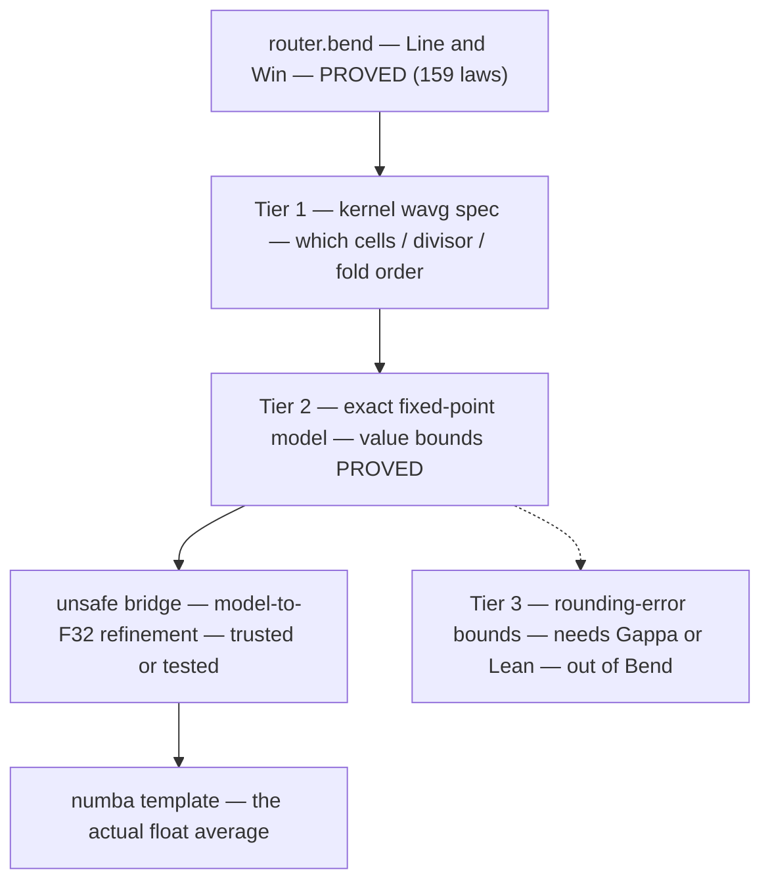

# Value-level verification of the routed averages — what Bend can and cannot do

> **New here?** Start with [README.md](README.md) — the guided tour (goals, data structures, the high-level laws). This file is a deep dive.

Scope note: the 159-law suite proves the ROUTING contract (which samples,
in what order, how old, no aliasing, no double-writes) and deliberately
says nothing about float VALUES — op-order is the kernel's contract and
the numba template is the value reference. This note answers the
follow-up question: **can we guarantee that the averages being routed are
CORRECT — and what would "a bit of unsafe" buy?**

## The honest baseline — the average does not exist in the proved layer

The Q2 anti-alias story: a slow subnet's input is the FAST lane's window
average. The router routes the WINDOW (Line{i0,i1,num,den,win} +
route_window's Win{lo,hi} — geometry fully proved: span == w, lo <= hi,
head age == d+w). The AVERAGING ITSELF happens in the numba template's
pre() (`backend/templates/nb-hybrid-sim.py.mako` L90 comment: Python
pre() averages the delayed threshold values) — there is no averaging
function in kernel.bend at all (only blend, cfun_linear, gather; the
wsum pipeline in mcore.bend L10-13 is the same shape template-side).

So "the averages being routed are correct" splits into three tiers of
claims with very different costs.

## Tier 1 — provenance of the average (provable in Bend today, no unsafe)

Define the spec function in the kernel, mirroring how blend/gather are
specified, and pin the WIRING:

    def wavg(tape, lo, w, ic) -> F32   # sum hist[lo..lo+w) / w  in pinned op-order

- `wavg_span`: the divisor is exactly w == hi - lo (window_span's consumer);
- `wavg_order`: the fold accumulates in index order (gather_cons-style —
  rounding order is the contract);
- `wavg_w1`: at w == 1 the average IS the point read (agreement law with
  route_read at the window head — read_i0_is_window_head's consumer);
- `wavg_cells`: the summed cells are exactly the routed window of the
  routed source tape (composes with route_window + the 6c wiring laws).

This is the cheap half of "the averages are routed correctly": the
average provably averages the RIGHT CELLS over the RIGHT SPAN in the
RIGHT ORDER. Roughly 4-6 laws in the established brick style. It is the
direct continuation of the l_win fix — the window field now provably
reaches the kernel, and Tier 1 pins what the kernel does with it.

## Tier 2 — the value mathematics, over an exact model (where "a bit of unsafe" lands)

What is NOT provable in Bend: universal float inequalities. Claims like
min <= avg <= max over symbolic F32 cannot normalize — Bend proves
equalities of open terms by reduction, not IEEE semantics. So the value
properties cannot be stated about F32 at all (honestly: not "hard" — the
wrong formalism).

What IS provable: the mathematics of averaging does not need floats.
Model samples as scaled integers (fixed-point, value x as x*2^k in Nat)
and define qavg over them; then prove, by ordinary induction in the
brick style (the divmod ladder is the effort yardstick):

- bounds: min of the window <= qavg <= max of the window;
- convexity/linearity: qavg is a convex combination — a weighted average
  lies between the window extremes and moves monotonically with any
  member;
- the ZOH-weighted monitor identity: the tavg VALUE is sum(hold_i * v_i)
  over the master span (the value half of monitor_zoh_average, whose
  schedule half is already proved);
- degenerate laws (w == 1, IC region, saturation behavior).

The UNSAFE part is then exactly ONE refinement statement: the F32
implementation matches the fixed-point model up to rounding. Options to
carry that statement:

1. **Trust IEEE-754 primitives** — already the implicit TCB of the
   op-order laws (blend_order only means anything if F32.add is IEEE
   add). Zero extra work; standard practice.
2. **Differential-test the refinement** — numpy/numba golden vectors vs
   the Bend model on fuzzed inputs (the bend-json pattern; bendcheck
   generators already run on 2.0.34). Empirical evidence, not proof.
3. **Prove the rounding bounds** — |float_avg - exact_avg| <= k ulp.
   NOT in Bend under any amount of unsafe. Needs Gappa or a
   Lean/Coq + Flocq sidecar. That is Tier 3.

Honest mechanics: Bend has no axiom/assume in the law language — the
gate demands ALL PROOFS CHECK and the verdict investigation (see
ECOSYSTEM.md) says the kernel is sound. So "unsafe" cannot live INSIDE
a proof file as a trusted hole — and faking one would poison the exact
trust the suite is built on. The unsafe lives where TCB assumptions
always live: a documented refinement contract (option 1), discharged
empirically (option 2) if desired.

(The Bend `unsafe` keyword — which relaxes the linearity rules — is a
different thing entirely: it can simplify PROOF ERGONOMICS (fewer
go-lemma wrappers for duplicated uses) but adds zero value
expressivity. Nothing about averages becomes provable because of it.)

## Tier 3 — out of reach even with unsafe

IEEE error analysis of the averaging fold (accumulated rounding across w
samples, compensated summation comparisons) is a floating-point
verification problem, not a term-equality problem. Route it to Gappa or
a Lean sidecar if it ever becomes load-bearing — or keep it empirical
(Tier 2 option 2) and call it testing.

## Recommendation

- **Do Tier 1 now** (a day, established pattern): it upgrades the
  guarantee from "the window is routed right" to "the routed average
  provably averages the routed cells" — the last unwired link of the
  mcore.bend pipeline at the spec level.
- **Tier 2 is the real value-proof** and is available whenever value
  guarantees become load-bearing — the unsafe cost is honest and
  bounded (one refinement statement + optional differential tests).
- **Do not chase Tier 3 in Bend** — wrong tool; the empirical route
  covers practice, Gappa/Lean covers proof.
